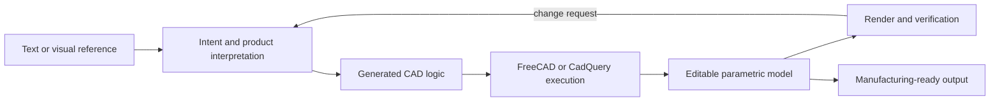

# Morfis

> Research status: **Architecture-level / closed-source boundary reached** · Last reviewed: **2026-08-11**

| Field | Value |
|---|---|
| Organization / team | Morfis team at SnT, University of Luxembourg |
| Ordinary job | describe or show a physical object, obtain a manufacturable parametric CAD model, and continue changing its engineering intent without learning a conventional CAD command surface first |
| Status | active functional product prototype moving through commercialization; the public site accepts access requests |
| Canonical artifact | executable parametric CAD logic plus the geometry produced by a CAD kernel |
| Canonical product | [morfis.ai](https://www.morfis.ai/) |
| Technical evidence | [Morfis startup-track paper](https://openreview.net/pdf/21284fbd34f6a5bac468c289f7482e6ff514f835.pdf) |
| Source availability | closed source |
| Pinned source revision | N/A — closed source |
| Evidence ceiling | the team discloses the input modes, multi-agent roles, CAD execution environments and parametric/manufacturing promise; operation schema, storage model, renderer, version protocol and production deployment remain private |

## The decisive claim is continuation after generation

Morfis is not counted because it can render an object from a prompt. Its public contract says the result is an **editable and manufacturable CAD model**. Text and visual input are interpreted into CAD logic, executed through an engineering environment such as FreeCAD or CadQuery, and returned as parametric geometry suitable for processes such as 3D printing.

The engineering acceptance test is therefore stronger than visual resemblance. A successful result must preserve controllable dimensions or features, regenerate through the CAD environment, and remain usable downstream. A mesh or image that merely looks right would not satisfy the team's own stated product boundary.

## CAD logic and the kernel divide authority

The startup paper describes a modular multi-agent architecture backed by vision-language models. One set of roles interprets the request; another generates CAD logic; tools execute it in open-source CAD environments; rendering and documentation tools provide feedback.

That establishes a two-layer authority:

| Layer | What it owns | What a user must verify |
|---|---|---|
| parametric CAD logic | reproducible design intent and editable operations | dimensions, parameters, feature order and response to later changes |
| CAD-kernel result | resolved topology and manufacturing geometry | valid bodies, faces, clearances and exportability |

The public material does not say whether Morfis stores CadQuery Python, a FreeCAD document, a proprietary intermediate representation, or several forms at once. It also does not establish which layer wins if stored code and a manually changed model diverge. Those are unresolved product-core questions rather than details that can be inferred from the named tools.

## Visual feedback is evidence over the model

The paper explicitly names real-time rendering and external documentation tools as support for generation and verification. That makes the viewport a feedback surface over executable engineering state. It does not make pixels the durable artifact.

The minimum ordinary-user loop implied by the evidence is:

1. supply a semantic request or visual reference;
2. receive generated parametric geometry;
3. inspect the resolved model rather than only a promotional render;
4. request a semantic or dimensional change;
5. confirm that the same model remains editable and regenerates;
6. take a valid result into a manufacturing path such as 3D printing.

Public evidence does not yet disclose face selection, constraint editing, feature-tree inspection, manual operation editing, or how visual targets are grounded back to parameters. Those behaviors require direct product acceptance rather than assumption.

## Persistence and recovery are still below the evidence ceiling

The product is presented as a platform for hobbyists, educators and product teams, with planned team workspaces and social collaboration. The paper also describes a functional prototype and a commercialization path. It does **not** publish a durable project schema or version contract.

Still unknown:

- whether a project reopens with prompts, references, CAD logic and kernel document intact;
- whether each revision is a snapshot, a parameter diff, a code revision or only chat history;
- whether the user can branch alternatives or restore an earlier manufacturable state;
- whether manual CAD edits survive a later agent regeneration;
- how failed kernel execution is rolled back;
- what exact file accompanies an exported manufacturing artifact.

Until those are directly tested or documented, a successful demo establishes generation and continuation intent but not full recovery semantics.

## Team boundary and lifecycle

The technical paper identifies Dimitrios Mallis, Anis Kacem and Djamila Aouada at [SnT, University of Luxembourg](https://www.uni.lu/snt-en/). It describes a functional prototype shown in industrial and academic settings and a commercialization-funding path. Current product identity is independently visible at the Morfis domain.

This record therefore represents the Morfis product lineage under the University of Luxembourg research umbrella. It does not treat the underlying FreeCAD or CadQuery projects as Morfis products, nor does it count the team's earlier CAD-Assistant research separately without an independently surfaced workspace.

## Evidence-bounded conclusion

Morfis crosses the inclusion boundary because the public product and first-party technical account agree on a complete engineering direction: semantic input becomes CAD logic, a CAD kernel resolves it, the output remains parametric and editable, and the result is intended for manufacturing. The closed-source boundary prevents claims about its internal document schema, exact mutation protocol and recovery model. Those remain explicit acceptance targets instead of being filled with generic CAD assumptions.

## Primary evidence

- [Morfis product](https://www.morfis.ai/)
- [Morfis: AI-Assisted Physical Product Customization](https://openreview.net/pdf/21284fbd34f6a5bac468c289f7482e6ff514f835.pdf)
- [SnT, University of Luxembourg](https://www.uni.lu/snt-en/)
