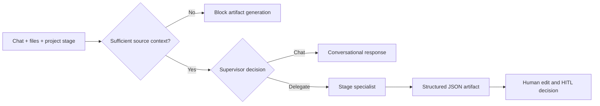

# SilverCraft AI

> Research status: **Source-level** · Lifecycle: **active** · Last reviewed: **2026-08-12**

SilverCraft AI defines “design” as governed data architecture rather than visual styling. A staged supervisor turns supplied source context into source-analysis, conceptual, logical or physical data-model artifacts; people inspect and edit the resulting structured model before approving it.

## Delegation is constrained by stage and evidence

At commit [`a27322f0`](https://github.com/yathik-2622/silvercraft-ai/tree/a27322f0f69a525e3f468ab0ecbd41a9a5bc3573), [`chat_orchestration.py`](https://github.com/yathik-2622/silvercraft-ai/blob/a27322f0f69a525e3f468ab0ecbd41a9a5bc3573/backend/core/chat_orchestration.py) implements a LangGraph flow around an OpenAI-compatible chat-completions endpoint. An intake node blocks source-analysis artifact generation when no attachment or source metadata is present. A supervisor then classifies a request as ordinary chat or delegated work, and only delegated work enters a stage specialist.

Each specialist has a different strict JSON contract: source analysis returns tables and relationships; conceptual modeling returns concepts; logical modeling returns entities; physical modeling returns tables, mappings and DDL-oriented fields. Markdown skills are injected into the stage prompt, while agent-run and A2A records preserve orchestration evidence.

This is a real orchestration boundary, but it is not an open-ended autonomous loop: the current stage selects the specialist, the output shape is constrained, and approval remains human-owned.

## One structured artifact has several views

[`StructuredCanvas.tsx`](https://github.com/yathik-2622/silvercraft-ai/blob/a27322f0f69a525e3f468ab0ecbd41a9a5bc3573/frontend/src/components/studio/StructuredCanvas.tsx) parses the stored artifact JSON and projects it as ERD, attribute and source-to-target mapping views. The structured UI currently provides narrow direct edits such as renaming entity or table titles; a raw artifact editor can change the complete serialized content. Saving writes the whole JSON string back.

The canvas is therefore a projection of the artifact, not an independently authoritative graph. Legacy prose artifacts that cannot be parsed do not become equivalent structured models.

## Approval history and artifact history are different

[`artifacts.py`](https://github.com/yathik-2622/silvercraft-ai/blob/a27322f0f69a525e3f468ab0ecbd41a9a5bc3573/backend/api/routes/artifacts.py) stores each artifact's current serialized content and review status in MongoDB. Content updates overwrite that field. Approve or reject actions append separate human-in-the-loop decision records, so the system can retain governance evidence without retaining every prior content revision.

[`project.py`](https://github.com/yathik-2622/silvercraft-ai/blob/a27322f0f69a525e3f468ab0ecbd41a9a5bc3573/backend/models/project.py) also records project canvas/workflow snapshots. Those should not be mistaken for a revision graph of every artifact body. Current exports package persisted artifacts into documents; DDL and spreadsheet helper modules exist in source, but the verified Studio path does not establish them as the universal delivery path.

## What SilverCraft adds to the map

SilverCraft shows a definition of AI-native design centered on evidence gates, stage-specific schemas and explicit human approval. The visual canvas coordinates review of a data architecture; it is not the primary source of truth. Its unresolved lifecycle gap is content versioning: governance decisions are durable, while artifact edits overwrite current content.

## Evidence

- [Pinned product and ADM workflow](https://github.com/yathik-2622/silvercraft-ai/blob/a27322f0f69a525e3f468ab0ecbd41a9a5bc3573/README.md)
- [Supervisor, specialists and evidence gate](https://github.com/yathik-2622/silvercraft-ai/blob/a27322f0f69a525e3f468ab0ecbd41a9a5bc3573/backend/core/chat_orchestration.py)
- [Structured artifact projections and edits](https://github.com/yathik-2622/silvercraft-ai/blob/a27322f0f69a525e3f468ab0ecbd41a9a5bc3573/frontend/src/components/studio/StructuredCanvas.tsx)
- [Artifact persistence and HITL decisions](https://github.com/yathik-2622/silvercraft-ai/blob/a27322f0f69a525e3f468ab0ecbd41a9a5bc3573/backend/api/routes/artifacts.py)
