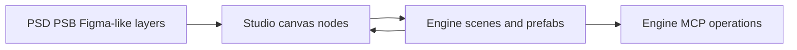

# VberAI Studio

> Research status: **Architecture-level** · Last reviewed: **2026-08-12**

| Field | Value |
|---|---|
| Team | Shanghai Xingyun Network Technology · Shanghai China |
| Domain | game art and UI production for Unity Cocos Creator and Godot |
| Canvas authority | editable layer nodes with component type state transitions and asset references |
| Engine authority | scenes prefabs scripts bindings materials and project assets |
| Lifecycle | active; Design MCP and some automation remain roadmap items |

## The hard problem is preserving engine meaning

VberAI Studio imports PSD or PSB layers Figma-like designs and assets or scenes from an existing engine project. Agent-generated UI concept and level art land as editable nodes instead of flattened delivery images. A selected layer can be cropped split rasterized expanded inpainted extracted or assigned an engine control type.

The one-click reskin operation is structural: imagery fonts and effects change while hierarchy component identities script bindings and asset references are claimed to remain stable. That is what makes a visual variant usable by a game team rather than merely similar-looking media.

## Bidirectional delivery

When exporting to Unity Cocos or Godot the canvas materializes scenes prefabs components and art assets with configured default states and transitions. Engine MCP then lets an agent continue code scene configuration asset and debugging work inside the engine. Reverse flow pulls a scene or prefab back to the visual canvas while preserving component binding material texture and script attributes.

The public surface calls the canvas a single source of truth for cross-role work but also acknowledges engine-native state. This dossier therefore treats the system as two explicit authorities joined by structure-preserving materialization rather than pretending they are one file format.

## Primary evidence

- [VberAI Studio workflow](https://vberai.com/studio)
- [VberAI platform and operating entity](https://vberai.com/ai-studio/bg-removal)
- [VberAI Godot and engine product map](https://vberai.com/game-engines/godot)
