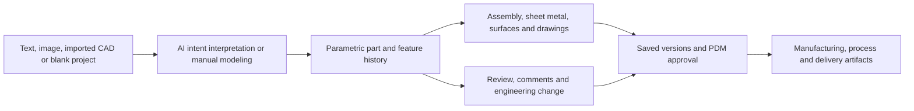

# zCAD / Zixel 3D CAD

> Research status: **Architecture-level / closed-source boundary reached** · Last reviewed: **2026-08-11**

| Field | Value |
|---|---|
| Organization / team | Zixel (子虔科技); official locations in Shanghai, Paris, Singapore and Islamabad |
| Ordinary job | generate or model precise parts and assemblies, preserve parametric intent, review changes and advance approved engineering data toward manufacturing |
| Status | active Zixel 3D CAD / zCAD Online; separate zCAD AI for Mac remains a limited private preview |
| Canonical artifact | cloud-managed parametric parts, assemblies, drawings, design history and connected PDM records |
| Canonical URL | [zcad.ai](https://www.zcad.ai/) |
| Current product documentation | [Zixel 3D CAD](https://www.zixel3d.com/en/product/cad) |
| Source availability | closed source; first party claims a self-developed cloud CAD kernel |
| Pinned source revision | N/A — closed source |
| Evidence ceiling | public contracts establish parametric authority, collaboration, versioning, PDM and AI entry; geometric-kernel code, feature schema, solver, agent protocol and deployment internals are undisclosed |

## AI output is required to continue as engineering CAD

zCAD's most important claim is not text-to-3D appearance. The [AI-native workflow](https://www.zcad.ai/) says text or a reference image becomes an **editable parametric model** that the user continues shaping through dimensions, constraints, features and design history. The product contrasts that path with flattening or rebuilding generated geometry.

That continuation test distinguishes an engineering artifact from a mesh-like visual result. A render can look correct while dimensions, constraints, feature dependencies, topology or manufacturing semantics are absent. zCAD publicly places authority in the parametric model and connected product data.

## The artifact has constraint, topology and lifecycle structure

The [3D CAD product contract](https://www.zixel3d.com/en/product/cad) names sketch, part, assembly and drawing modules plus sheet-metal and advanced-surface tools. The current [download and version page](https://www.zixel3d.com/downloads) lists sketch arrays, intersection constraints, dimension editing, extrusion and revolve operations in the 2026-06-30 release.

The public object model is not published as a schema, but ordinary behavior requires at least these distinctions:

| Engineering state | Why it matters to AI or manual editing |
|---|---|
| sketches, dimensions and constraints | encode controllable design intent before solid features are solved |
| ordered features and design history | later changes must preserve or deliberately repair dependencies |
| B-rep or equivalent model topology | faces, edges and bodies provide precise selectable geometry rather than only pixels |
| parts and assembly structure | composition and product hierarchy survive beyond one viewport |
| drawings and production geometry | communicate tolerances and manufacturing output |
| comments, marks and review state | coordinate decisions without becoming the geometry itself |
| versions, approvals, permissions and BOM/PDM data | determine which engineering state is current and releasable |

The company says its kernel is independently developed and optimized for cloud use, with topological stability and distributed operation. That is a first-party product claim, not a source-derived implementation finding. No public code allows this dossier to name the geometric representation, constraint solver or topological-naming algorithm.

## AI is one author over the same model, not a separate generator store

Current first-party surfaces describe several AI roles:

- zCAD AI accepts text and image input and proposes editable parametric geometry;
- the Zixel 3D CAD copilot analyzes design needs, offers suggestions and automates parametric component creation;
- product pages describe feature reuse, topology generation and automated error checks in engineering workflows;
- the user can continue with precise manual CAD operations after AI generation.

The working model is therefore shared between AI and conventional engineering tools. Public material does not show whether the agent emits a command plan, feature-tree diff, intermediate program or direct kernel calls. It also does not establish atomic rollback for a multi-feature AI operation. Acceptance must inspect dimensions, constraints, feature history, assembly relations and downstream drawings rather than only the rendered solid.

## Cloud-native means the model and review clocks converge in one service

Zixel says design data saves automatically, collaborators synchronize to the latest state and multiple users can edit in a browser. The [main product page](https://www.zixel3d.com/en/) also promises activity history and one-click version rollback.

Those contracts create at least four clocks:

1. local interactive modeling and viewport response;
2. automatically saved cloud design state;
3. named or managed versions that can be compared and reverted;
4. PDM approval and release state used by downstream teams.

A smooth viewport proves only the first. A saved version is not necessarily approved, and an approval record is not proof that every consumer has refreshed to it. The exact autosave interval, conflict-resolution algorithm, operation log, offline queue and multi-user merge semantics remain private.

## PDM changes the meaning of persistence

The [enterprise platform](https://www.zixel3d.com/en/enterprise) connects models, versions, BOMs, drawings, documents and approval flows on one data backbone. The pricing page separates lightweight design collaboration from design data management, manufacturing process delivery and enterprise governance.

This means persistence is not just “the CAD file reopened.” A complete engineering journey can include:

- geometry saved in the current design;
- a review comment bound to the relevant model/version;
- a change compared against an earlier version;
- a BOM or drawing updated consistently;
- approval and release state advanced;
- a downstream process or work instruction tied to the approved source.

The repository cannot verify that all modules share one physical database. It can establish that the product exposes them as a connected authority model and that PDM—not a screenshot or chat transcript—governs released state.

## Import, review and AI generation have different fidelity risks

Zixel advertises browser opening of more than 50 CAD formats and preservation of model structure and part parameters in its viewer. The [multi-CAD workflow](https://www.zcad.ai/scenario/multi-cad-large-models) positions browser review as a first step before structural edits in 3D CAD and version/release control in PDM.

Three paths must be tested separately:

| Entry path | Key fidelity question |
|---|---|
| native zCAD parametric model | do feature dependencies, constraints and topology survive AI/manual edits? |
| imported mainstream CAD | which native history, constraints, metadata and identifiers survive translation? |
| AI from text or image | does generated geometry contain editable engineering intent rather than only a plausible shape? |

Standard format export can make geometry interoperable while losing feature history or product metadata. Public pages do not publish a format-by-format round-trip matrix, so broad compatibility must not be translated into universal parametric fidelity.

## zCAD AI for Mac is a preview surface, not a second shipped lineage

The current zcad.ai page labels zCAD AI for Mac “coming soon” and invites people into limited preview waves. zCAD Online and Zixel 3D CAD already advertise active browser trials, current downloads and enterprise deployment. This dossier keeps them in one lineage because the preview explicitly hands generated parametric geometry into the existing cloud CAD environment.

It does not count a waitlist as a fully accepted product journey. Current conclusions about saving, collaboration, versioning and PDM rest on the shipped Zixel cloud platform; the text/image-to-parametric Mac path remains product-claimed and access-limited.

## Team boundary is distributed but publicly attributable

Zixel's official [about page](https://www.zixel3d.com/about) says the company was founded in 2020 and lists offices in Shanghai, Paris, Singapore and Islamabad; the English timeline says the AI-native 3D CAD product launched in 2025. This supports a multi-region public organization boundary.

It does not identify one internal zCAD squad or allocate engineering work among those locations. The verified sample represents the product lineage under Zixel and records the candidate region as multi-region rather than replacing team evidence with headquarters inference.

## Why “visual canvas” is an inadequate description

The decisive authority is neither source code rendered as a webpage nor a generic canvas scene graph. It is a parametric engineering model whose constraints, feature history, geometric topology, assemblies and release metadata determine whether an output is usable. Treating that merely as a “visual canvas” would erase the mechanism that makes an AI result editable and manufacture-ready.

This dossier establishes that project-specific mechanism. Any cross-project classification derived from it belongs in the root synthesis and `data/taxonomy.json`, not in the vendor's vocabulary or this project's factual narrative.

## Evidence boundary

- **Established:** Zixel ships a cloud-native 3D CAD platform with precise modeling, automatic save, collaboration, version compare/revert and PDM; current official material presents AI generation and assistance that continue as editable parametric CAD.
- **Inference:** the parametric part/assembly and its governed version are the working authority because AI, manual tools, review and downstream release converge on that structure.
- **Unknown:** kernel and solver implementation, exact model schema, agent command protocol, transaction and concurrency design, topology identity under edits, autosave cadence and cross-format fidelity matrix.
- **Not tested in this pass:** an invited zCAD AI generation, multi-user edit conflict, version rollback, PDM approval or import/export round trip with a real engineering model.

## Primary sources

- [zCAD AI-native workflow](https://www.zcad.ai/)
- [Zixel 3D CAD product contract](https://www.zixel3d.com/en/product/cad)
- [Current downloads and version record](https://www.zixel3d.com/downloads)
- [Zixel enterprise platform and connected PDM](https://www.zixel3d.com/en/enterprise)
- [Multi-CAD review and release workflow](https://www.zcad.ai/scenario/multi-cad-large-models)
- [Zixel organization history and locations](https://www.zixel3d.com/about)

## Research gaps

- Obtain preview access and inspect whether text/image generation creates an intelligible feature history with editable dimensions and constraints.
- Test a part edit that changes topology and observe reference stability in drawings, assemblies, comments and downstream PDM records.
- Publish a format-specific import/export matrix that distinguishes geometric appearance, B-rep topology, parameters, history, assemblies and metadata.
