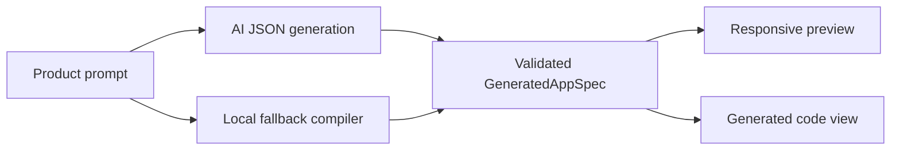

# Nova AI Builder in fast-code

> Research status: **Source-level** · Lifecycle: **active** · Last reviewed: **2026-08-13**

Nova does not generate an arbitrary repository. It asks a model for a typed product-and-screen specification, validates that JSON, then deterministically compiles the same spec into a responsive preview and a code representation. That structured intermediate artifact is the project's defining technical choice.

## The spec, not the displayed code, is canonical

Pinned revision: `343adb492a12a88893780aa6d947ca2f199f3bd2`.

`GeneratedAppSpec` fixes the artifact shape: kind, name, audience, navigation, palette, hero, metrics, sections, cards and workflows. The server function asks the AI gateway for exactly that shape and validates it with Zod. If the live call fails, a local compiler produces a prompt-specific spec with the same contract. The builder can therefore switch between preview and generated code without treating either projection as independent truth.

## Scope boundary

The files array in the model response is a plan, not a writable filesystem. No persisted project/version authority or deployment transaction is established in the inspected builder path. Nova is included as structured generative UI authoring, not misclassified as a full app IDE.

## Pinned evidence

- [Repository](https://github.com/CodewithShashi/fast-code)
- [Typed artifact model](https://github.com/CodewithShashi/fast-code/blob/343adb492a12a88893780aa6d947ca2f199f3bd2/src/lib/app-builder.types.ts)
- [AI generation and validation](https://github.com/CodewithShashi/fast-code/blob/343adb492a12a88893780aa6d947ca2f199f3bd2/src/lib/app-builder.functions.ts)
- [Preview/code compiler surface](https://github.com/CodewithShashi/fast-code/blob/343adb492a12a88893780aa6d947ca2f199f3bd2/src/routes/_app.builder.tsx)
