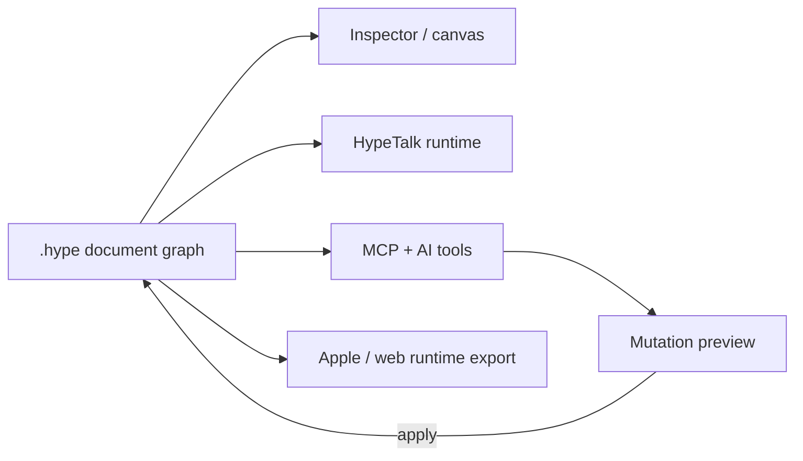

# Hype

> Research status: **Source-level** · Lifecycle: **active** · Last reviewed: **2026-08-12**

Hype revives the approachable stack/card/part model as a macOS-native authoring environment. Its AI assistant does not directly rewrite the document: it proposes typed mutations that cross an explicit preview/apply transaction boundary.

## One property vocabulary spans four surfaces

At commit [`1055ef6`](https://github.com/mweingartner/hype/tree/1055ef6f37d4016b67c55acdbd11a6c1e86bd35c) a `HypeDocument` owns cards backgrounds parts scripts assets and diagnostics inside a SQLite-backed `.hype` package. A shared property registry keeps the inspector HypeTalk runtime MCP automation and AI tools aligned.

[`DocumentMutationCoordinator.swift`](https://github.com/mweingartner/hype/blob/1055ef6f37d4016b67c55acdbd11a6c1e86bd35c/Sources/Hype/DocumentMutationCoordinator.swift) centralizes applied changes. AI can use local Ollama by default or configured hosted providers and the mutation preview lets a human inspect the proposed transaction before it changes the stack.

Target-aware export checks capability gaps instead of promising every part on every runtime. Public first-party evidence did not establish the maintainer's physical region.

## Pinned evidence

- [AI design decisions](https://github.com/mweingartner/hype/blob/1055ef6f37d4016b67c55acdbd11a6c1e86bd35c/ActiveAIDesign.md)
- [MCP automation registry](https://github.com/mweingartner/hype/blob/1055ef6f37d4016b67c55acdbd11a6c1e86bd35c/Sources/Hype/MCP/HypeAutomationRegistry.swift)
- [Pinned README](https://github.com/mweingartner/hype/blob/1055ef6f37d4016b67c55acdbd11a6c1e86bd35c/README.md)
