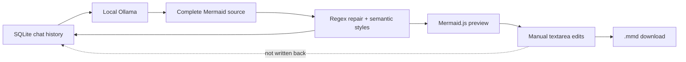

# LLMO AI Diagram Architect

> Research status: **Source-level** · Lifecycle: **active** · Last reviewed: **2026-08-12**

LLMO defines a local conversational architecture-diagram workspace: Ollama supplies complete Mermaid source, small deterministic transforms repair and style it, and SQLite preserves generated conversation turns. Its lifecycle has a subtle split—generated code is durable, later manual code edits are not.

## The local model receives the conversation

At commit [`6f914043`](https://github.com/NovaCX23/LLMO-DiagramGenerator/tree/6f91404320673e9b734a8fb7880e4a7163b6331b), [`main.py`](https://github.com/NovaCX23/LLMO-DiagramGenerator/blob/6f91404320673e9b734a8fb7880e4a7163b6331b/main.py) sends the current session’s messages to a local `qwen2.5-coder:7b` through Ollama. The [system prompt](https://github.com/NovaCX23/LLMO-DiagramGenerator/blob/6f91404320673e9b734a8fb7880e4a7163b6331b/prompts.py) asks for one fenced Mermaid block, instructs the model to fill architectural gaps and tells it to modify the previous diagram when a user asks for an update.

This is genuinely multi-turn at the chat level. It is not tool calling: the model returns a complete source string on each generation turn and does not inspect the Mermaid renderer or receive structured parse errors.

## Repair and styling are text transforms, not a compiler

Application code extracts the fenced block, normalizes class commas and subgraph names, quotes a narrow rectangle-label pattern, changes flow direction and appends semantic class definitions based on node-ID keywords. These rules can improve common outputs but do not parse the Mermaid grammar.

`looks_like_mermaid` checks only whether the first meaningful line starts with a known diagram family. The actual validity boundary is Mermaid.js 10.6 in the embedded browser component. Rendering uses `securityLevel: "loose"` and loads Mermaid from jsDelivr at runtime. The LLM and database are local, but the shipped preview is therefore not literally network-independent after setup.

## SQLite history preserves generated turns

The local database has sessions and append-only messages. Each assistant message can carry the generated Mermaid source; loading a session reconstructs chat context and selects the most recent stored generated code. Sessions can be created, renamed by the first prompt and deleted.

The live editor then assigns textarea changes only to Streamlit session state. It does not update the stored assistant message or append a manual revision. After a reload, the latest generated source returns and unsaved manual corrections disappear. A later Ollama turn also sees the prior raw assistant message, not necessarily the manually changed code.

## Source is the delivery artifact

The UI downloads the current textarea as `diagram.mmd` and offers a full-screen live preview. There is no built-in SVG/PNG export in the verified app path. The editable source handoff is therefore stronger than the persistence of manual edits: a user must download the file to make those changes durable.

LLMO contributes a local-first, conversation-retaining definition of AI design, while showing that “session history” and “artifact version history” are not interchangeable. Its database remembers generated turns; the human-corrected artifact remains transient unless exported.

## Evidence

- [Pinned repository and architecture claims](https://github.com/NovaCX23/LLMO-DiagramGenerator/blob/6f91404320673e9b734a8fb7880e4a7163b6331b/README.md)
- [Ollama, editing, rendering and SQLite lifecycle](https://github.com/NovaCX23/LLMO-DiagramGenerator/blob/6f91404320673e9b734a8fb7880e4a7163b6331b/main.py)
- [Generation contract](https://github.com/NovaCX23/LLMO-DiagramGenerator/blob/6f91404320673e9b734a8fb7880e4a7163b6331b/prompts.py)
