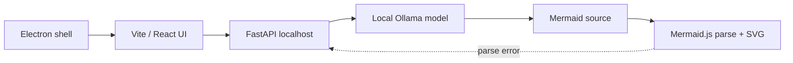

# Mermaid Live Desktop

> Research status: **Source-level** · Lifecycle: **active** · Last reviewed: **2026-08-12**

Mermaid Live Desktop is a deliberately small local-AI workbench: natural language becomes Mermaid through Ollama, a code editor remains available for exact changes, and renderer failures can be sent back to the local model for repair.

## The desktop boundary is privacy, not a new artifact format

At commit [`2d899f95`](https://github.com/CagriCatik/Mermaid-Live-Desktop/tree/2d899f9536a597a4c4351f4d96383656878f4c9a), Electron starts a Python process and loads the React application. [`services.py`](https://github.com/CagriCatik/Mermaid-Live-Desktop/blob/2d899f9536a597a4c4351f4d96383656878f4c9a/backend/app/services.py) calls a locally installed Ollama model at low temperature; no cloud-provider adapter is present. The model returns Mermaid text, optionally with a separated reasoning block. That text—not an Electron-native document—is the artifact authority.

The app has two asymmetric AI operations:

1. Semantic text is debounced for 800 ms and submitted to `/generate/mermaid`; successful output replaces the current Mermaid string.
2. [`Preview.tsx`](https://github.com/CagriCatik/Mermaid-Live-Desktop/blob/2d899f9536a597a4c4351f4d96383656878f4c9a/frontend/src/components/Preview.tsx) reports the real browser parser error; the user can explicitly invoke `/repair/mermaid`, which supplies both source and error to Ollama.

The second path is the decisive mechanism: repair is grounded in a renderer-observed failure instead of a generic “improve this diagram” prompt.

## Runtime topology

[`main.cjs`](https://github.com/CagriCatik/Mermaid-Live-Desktop/blob/2d899f9536a597a4c4351f4d96383656878f4c9a/frontend/electron/main.cjs) owns the Python child lifecycle. It also records that production backend packaging remains TODO, while `nodeIntegration` is enabled and context isolation disabled. The repository therefore proves a working local development topology more strongly than a hardened distributable desktop boundary.

## What survives and what does not

The current diagram, semantic prompt, model selection, activity log, pan and zoom are React component state in [`App.tsx`](https://github.com/CagriCatik/Mermaid-Live-Desktop/blob/2d899f9536a597a4c4351f4d96383656878f4c9a/frontend/src/App.tsx). There is no project database, browser persistence, named history or conversation transcript. SVG download is the only implemented durable delivery path. Consequently “desktop” here means local execution and local inference, not a native file/version model.

## Landscape significance

This project defines AI design as a private repair loop around text syntax. It is materially different from cloud workspaces and proposal-gated semantic graphs: the model can replace the source directly, but only a local renderer decides whether that source is usable.

## Evidence

- [Pinned product contract](https://github.com/CagriCatik/Mermaid-Live-Desktop/blob/2d899f9536a597a4c4351f4d96383656878f4c9a/README.md)
- [Ollama generation and repair service](https://github.com/CagriCatik/Mermaid-Live-Desktop/blob/2d899f9536a597a4c4351f4d96383656878f4c9a/backend/app/services.py)
- [UI state, debounced generation and SVG export](https://github.com/CagriCatik/Mermaid-Live-Desktop/blob/2d899f9536a597a4c4351f4d96383656878f4c9a/frontend/src/App.tsx)
- [Electron process boundary](https://github.com/CagriCatik/Mermaid-Live-Desktop/blob/2d899f9536a597a4c4351f4d96383656878f4c9a/frontend/electron/main.cjs)
