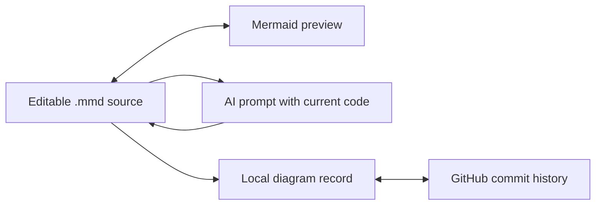

# Smart Mermaid Assistance

> Research status: **Source-level** · Lifecycle: **active** · Last reviewed: **2026-08-12**

Smart Mermaid Assistance is a native desktop Mermaid workspace whose unusual differentiator is direct GitHub synchronization. The `.mmd` source is simultaneously editor state, AI context and a versionable repository artifact.

## A follow-up prompt includes the current source

At commit [`c1246ec0`](https://github.com/daewu14/smart-mermaid-app/tree/c1246ec0fe28c65f5027a5e542a8d2f55fff646b) [`Editor.vue`](https://github.com/daewu14/smart-mermaid-app/blob/c1246ec0fe28c65f5027a5e542a8d2f55fff646b/frontend/src/Editor.vue) appends current Mermaid code to modification prompts. Streamed output replaces the editable source only after Mermaid extraction. Manual edits go through the same live parser in [`Preview.vue`](https://github.com/daewu14/smart-mermaid-app/blob/c1246ec0fe28c65f5027a5e542a8d2f55fff646b/frontend/src/Preview.vue).

## Local save and Git commit are separate persistence layers

The Go backend stores complete diagram records under `~/.smart-mermaid/diagrams`. [`SyncToGitHub`](https://github.com/daewu14/smart-mermaid-app/blob/c1246ec0fe28c65f5027a5e542a8d2f55fff646b/app.go#L164) then writes the `.mmd` through GitHub's Contents API with a named commit. Pull and delete paths retain remote SHA awareness.

The application does not offer a native semantic graph or collaborative CRDT; those are not implied. The maintainer profile locates the lineage in Yogyakarta Indonesia.

## Evidence

- [Pinned product contract](https://github.com/daewu14/smart-mermaid-app/blob/c1246ec0fe28c65f5027a5e542a8d2f55fff646b/README.md)
- [Local save and GitHub sync implementation](https://github.com/daewu14/smart-mermaid-app/blob/c1246ec0fe28c65f5027a5e542a8d2f55fff646b/app.go)
- [Source-aware generation UI](https://github.com/daewu14/smart-mermaid-app/blob/c1246ec0fe28c65f5027a5e542a8d2f55fff646b/frontend/src/Editor.vue)
