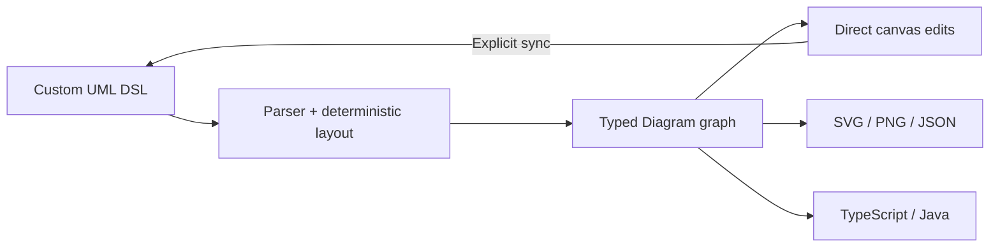

# UML Flow

> Research status: **Source-level** · Lifecycle: **active** · Last reviewed: **2026-08-12**

UML Flow defines design as a typed software model that can be entered as a custom DSL or manipulated on a canvas. Its most consequential boundary is explicit synchronization: DSL compiles into a graph automatically, but visual edits become source only when the user asks to sync them back.

## The compiler establishes semantic authority

At commit [`d313ddf6`](https://github.com/josapratama/uml-flow/tree/d313ddf65357f5f691906382689a96ae6ac837b3), the [shared types](https://github.com/josapratama/uml-flow/blob/d313ddf65357f5f691906382689a96ae6ac837b3/packages/shared/src/types.ts) define nine diagram families and typed classes, participants, states, entities, components, deployment nodes and relationships. The [`/compile` route](https://github.com/josapratama/uml-flow/blob/d313ddf65357f5f691906382689a96ae6ac837b3/packages/backend/src/routes/compile.ts) lexes and parses the DSL, then applies one of several deterministic layout strategies to create that `Diagram` graph.

The graph is the canvas-time authority. Users can move, resize, add, rename, connect and style elements, and validation operates on the graph. [`dsl-generator.ts`](https://github.com/josapratama/uml-flow/blob/d313ddf65357f5f691906382689a96ae6ac837b3/packages/backend/src/export/dsl-generator.ts) can regenerate source, but [`App.tsx`](https://github.com/josapratama/uml-flow/blob/d313ddf65357f5f691906382689a96ae6ac837b3/packages/frontend/src/App.tsx) exposes that as an explicit “Sync to code” action. This is a controlled dual-authority system, not invisible lossless two-way binding.

Some visual-only details and unsupported node types are filtered during source regeneration, so round trips preserve the modeled structure more reliably than every presentation detail.

## AI is an optional DSL bootstrap

[`ai-assistant.ts`](https://github.com/josapratama/uml-flow/blob/d313ddf65357f5f691906382689a96ae6ac837b3/packages/frontend/src/services/ai-assistant.ts) calls a user-configured OpenAI-compatible endpoint with `gpt-3.5-turbo` when a key is present. It requests DSL text and falls back to a small keyword-based class template if no provider is configured or a request fails. The current system prompt itself is class-diagram-centric even though the UI lists all nine diagram types.

The generated source is previewed before “Apply & Compile.” The model never receives canvas tools, current graph state or a multi-turn memory. Its authority ends at the same parser boundary as manually written DSL. The browser stores the endpoint and API key in local storage.

## Delivery derives from the reviewed graph

The backend exports graph JSON, SVG and regenerated DSL. The client captures the full SVG into PNG, and [`code-generator.ts`](https://github.com/josapratama/uml-flow/blob/d313ddf65357f5f691906382689a96ae6ac837b3/packages/frontend/src/services/code-generator.ts) projects class diagrams into TypeScript or Java. These outputs derive from the current graph rather than from a second model call.

## “Versions” are saved snapshots, not an append-only ledger

[`storage.ts`](https://github.com/josapratama/uml-flow/blob/d313ddf65357f5f691906382689a96ae6ac837b3/packages/frontend/src/services/storage.ts) keeps the current code, current graph and at most fifty named library entries in browser local storage. Saving the active entry overwrites it; the diff panel compares the current graph with another manually saved entry. A separate fifty-step undo stack is memory-only.

The backend contains a `.data/diagrams.json` CRUD route that increments a version number, but the verified frontend API client does not call those diagram CRUD endpoints. That route overwrites each current graph in any case; it does not retain prior bodies. The ordinary product path is therefore browser-local snapshots, not server-backed durable version history.

UML Flow adds a compiler-oriented definition of AI design: source and direct manipulation meet at a typed graph, with explicit rather than magical synchronization between representations.

## Evidence

- [Pinned product and DSL examples](https://github.com/josapratama/uml-flow/blob/d313ddf65357f5f691906382689a96ae6ac837b3/README.md)
- [Typed diagram artifact model](https://github.com/josapratama/uml-flow/blob/d313ddf65357f5f691906382689a96ae6ac837b3/packages/shared/src/types.ts)
- [Parse, layout, export and validation boundary](https://github.com/josapratama/uml-flow/blob/d313ddf65357f5f691906382689a96ae6ac837b3/packages/backend/src/routes/compile.ts)
- [Browser persistence contract](https://github.com/josapratama/uml-flow/blob/d313ddf65357f5f691906382689a96ae6ac837b3/packages/frontend/src/services/storage.ts)
