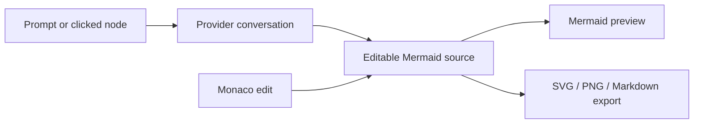

# Vibe Mermaid Editor

> Research status: **Source-level** · Lifecycle: **active** · Last reviewed: **2026-08-12**

Vibe Mermaid defines AI diagramming as a bilingual, provider-flexible conversation around one editable Mermaid program. Its product is not a generic canvas: the same text is generated, manually edited, validated, rendered and exported.

## One source, two editing languages

At commit [`81f9dc9a`](https://github.com/huangpufan/vibe-mermaid/tree/81f9dc9a05462c2c4f2d43b39bb0ef6dcf0f21ee), the Zustand store in [`store.ts`](https://github.com/huangpufan/vibe-mermaid/blob/81f9dc9a05462c2c4f2d43b39bb0ef6dcf0f21ee/src/lib/store.ts) makes `code` the authority. Monaco changes that string directly; [`Preview.tsx`](https://github.com/huangpufan/vibe-mermaid/blob/81f9dc9a05462c2c4f2d43b39bb0ef6dcf0f21ee/src/components/Preview.tsx) renders it with Mermaid. The other editing language is conversation: [`ChatPanel.tsx`](https://github.com/huangpufan/vibe-mermaid/blob/81f9dc9a05462c2c4f2d43b39bb0ef6dcf0f21ee/src/components/ChatPanel.tsx) sends recent messages, current source and optional clicked-node references, then installs extracted Mermaid output back into the same store.

This produces a concrete source-mapping loop:

A clicked rendered node is not independently editable geometry. It is converted into a semantic reference for the next source-generating prompt. That keeps the authority in Mermaid rather than creating a second canvas model.

## AI is a source rewriter, with bounded conversation memory

[`/api/chat`](https://github.com/huangpufan/vibe-mermaid/blob/81f9dc9a05462c2c4f2d43b39bb0ef6dcf0f21ee/src/app/api/chat/route.ts) accepts OpenAI-compatible provider configuration, retains at most 15 recent messages, calls the selected model, and extracts either the project's sentinel-delimited Mermaid block or a fenced Mermaid block. The store keeps 50 source snapshots for undo/redo.

The repository documentation says calls are client-side and keys never reach the application server, but the implementation is more precise: browser code posts the API key to a Next.js route, and that route constructs the provider client. The key is not shown as durably stored server-side, but it does traverse the app server. This distinction matters for self-hosting and threat modeling.

## Persistence stops short of a project model

The persisted browser slice contains provider settings, current Mermaid source, theme and preferences. Chat messages and the undo/redo stacks are not in that persisted slice. There is no account workspace, file collection, collaboration model or durable named-version graph. Export is therefore the handoff boundary, implemented in [`ExportDialog.tsx`](https://github.com/huangpufan/vibe-mermaid/blob/81f9dc9a05462c2c4f2d43b39bb0ef6dcf0f21ee/src/components/ExportDialog.tsx) and [`exportUtils.ts`](https://github.com/huangpufan/vibe-mermaid/blob/81f9dc9a05462c2c4f2d43b39bb0ef6dcf0f21ee/src/lib/exportUtils.ts).

## What this implementation contributes to the landscape

Vibe Mermaid is evidence for a source-first definition of design: AI does not own pixels, and the user does not have to choose between prompting and exact syntax. Its distinct move is node-referenced conversation over editable diagram code, not a semantic graph or freeform direct-manipulation canvas.

## Evidence

- [Pinned product and provider contract](https://github.com/huangpufan/vibe-mermaid/blob/81f9dc9a05462c2c4f2d43b39bb0ef6dcf0f21ee/README.md)
- [State, history and persisted slice](https://github.com/huangpufan/vibe-mermaid/blob/81f9dc9a05462c2c4f2d43b39bb0ef6dcf0f21ee/src/lib/store.ts)
- [Conversational source replacement](https://github.com/huangpufan/vibe-mermaid/blob/81f9dc9a05462c2c4f2d43b39bb0ef6dcf0f21ee/src/components/ChatPanel.tsx)
- [Provider route and response extraction](https://github.com/huangpufan/vibe-mermaid/blob/81f9dc9a05462c2c4f2d43b39bb0ef6dcf0f21ee/src/app/api/chat/route.ts)
