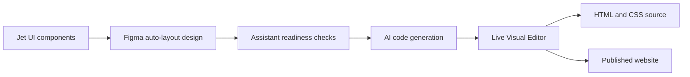

# Codejet

> Research status: **Architecture-level** · Last reviewed: **2026-08-11**

| Field | Value |
|---|---|
| Team | Codejet · team region not established |
| Ordinary job | turn Figma layouts into a website that can be visually corrected and launched |
| Authority transition | Figma design before generation; HTML and CSS project after continued editing |
| Lifecycle | active |

## The design system constrains translation

Codejet combines a Jet UI component system a Figma Assistant an AI code generator and a beta Visual Editor. The preferred path starts with known Figma components and auto-layout. The Assistant checks frames for code readiness and the AI translates selected designs into site code. The generated result then opens in a live editor rather than ending as a screenshot.

The component system is part of the technical strategy: familiar component and layout structure reduces the ambiguity that a generic screenshot converter must solve. Arbitrary auto-layout designs are also accepted but public material gives the strongest contract for Jet UI-based inputs.

## Where authority moves

Figma is authoritative for the selected starting design. Once the site is edited in the Visual Editor and launched the code project contains changes that may not exist upstream. Current documentation establishes generation and continued editing but not reverse synchronization into the original Figma file.

## Evidence ceiling

Model identity intermediate representation component matching output stability visual-editor serialization and versioning are not public. The current FAQ documents HTML and CSS output while broader framework claims should not be inferred from older discovery snippets.

## Primary evidence

- [Codejet product](https://www.codejet.ai/)
- [Figma Assistant product surface](https://www.codejet.ai/figma-plugin)
- [Codejet tool architecture](https://docs.codejet.ai/introduction)
- [Current end-to-end quickstart](https://docs.codejet.ai/quickstart)
