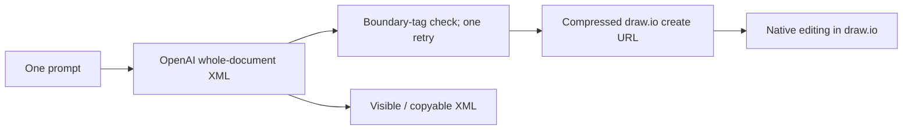

# AI Diagram Generator / Draw.io Codex

> Research status: **Source-level** · Lifecycle: **active** · Last reviewed: **2026-08-12**

Draw.io Codex is a one-shot native-artifact handoff. The app itself has no canvas: OpenAI proposes mxGraph XML, the server embeds it in a draw.io creation URL, and the mature external editor takes over continued authoring.

## The model writes the editor’s native document

At commit [`7144fdce`](https://github.com/JSL124/Draw.io_codex/tree/7144fdcee0c8c2e1b4cb81a1edc0cb3aa074eb79), [`openai.js`](https://github.com/JSL124/Draw.io_codex/blob/7144fdcee0c8c2e1b4cb81a1edc0cb3aa074eb79/backend/openai.js) calls the OpenAI Responses API, defaulting to GPT-4.1 mini, and asks for an entire `mxGraphModel`. API credentials stay on the server.

Its “validation” is intentionally shallow: it checks that the response is nonempty and contains opening and closing `mxGraphModel` strings. A failed check triggers one fresh model attempt. The code does not parse XML, verify cell references or load the result in draw.io before declaring generation successful. Native format and native validity are separate claims here.

## A create URL transfers authority without an integration API

[`mcpClient.js`](https://github.com/JSL124/Draw.io_codex/blob/7144fdcee0c8c2e1b4cb81a1edc0cb3aa074eb79/backend/mcpClient.js) URI-encodes and raw-deflates the XML, wraps it in a `create` payload and returns an `app.diagrams.net` URL. Despite the filename, this module does not call an MCP server; the returned metadata explicitly identifies a local URL generator.

Opening that URL imports the model-produced XML into draw.io. From that moment draw.io owns rendering, manual correction and native save/export. The generating app has no callback, live synchronization or way to receive later edits.

## The handoff is portable but ephemeral

[`result-panel.tsx`](https://github.com/JSL124/Draw.io_codex/blob/7144fdcee0c8c2e1b4cb81a1edc0cb3aa074eb79/components/result-panel.tsx) exposes the XML, lets the user copy it, displays structured response metadata and opens the editor URL. Prompt and result live only in React state. There are no saved projects, generation history, iterative edits or local source files.

The project adds a minimal design-code bridge to the landscape: produce the native document of an established visual editor and get out of the way. Its key limitation is evidence quality—the external editor is the eventual authority, but the app does not use that editor as its pre-handoff validator.

## Evidence

- [Pinned product flow](https://github.com/JSL124/Draw.io_codex/blob/7144fdcee0c8c2e1b4cb81a1edc0cb3aa074eb79/README.md)
- [Whole-document generation and tag checks](https://github.com/JSL124/Draw.io_codex/blob/7144fdcee0c8c2e1b4cb81a1edc0cb3aa074eb79/backend/openai.js)
- [Local draw.io create-link construction](https://github.com/JSL124/Draw.io_codex/blob/7144fdcee0c8c2e1b4cb81a1edc0cb3aa074eb79/backend/mcpClient.js)
- [Source-visible handoff UI](https://github.com/JSL124/Draw.io_codex/blob/7144fdcee0c8c2e1b4cb81a1edc0cb3aa074eb79/components/result-panel.tsx)
