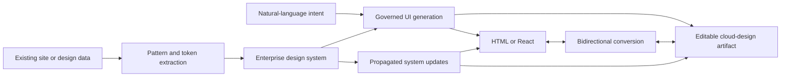

# HOZO

> Research status: **Architecture-level** · Last reviewed: **2026-08-11**

| Field | Value |
|---|---|
| Team | Dentsu Digital Inc. · Japan |
| Ordinary job | rebuild and continuously govern enterprise website UI from an existing site and design system through natural-language operation |
| Authority model | design-system rules govern two editable projections: code and a cloud design document |
| Lifecycle | newly operational service method |

## Reverse extraction establishes the constraints first

HOZO starts from an existing website URL or cloud-design data. It extracts and classifies navigation cards tables CTAs colors typography and spacing into reusable patterns and tokens. AI then composes compliant components and pages from natural-language requests rather than inventing an unrelated visual language.

The release explicitly describes human review in both professional surfaces. Designers review the editable cloud artifact while engineers review code. A changed system part can propagate into previously generated UI so governance continues after first generation.

## A method delivered as a service is still a product boundary

HOZO is not presented as a self-serve public SaaS. Dentsu Digital says the method entered operation for client website construction and management. It is counted as one team definition because it has a named operational mechanism and artifact loop not because it has a signup page.

## Evidence ceiling

The cloud-design host conversion representation supported code subset synchronization conflict policy and customer deployment are undisclosed. “Bidirectional” is recorded only for the supported HOZO representations; it is not generalized to arbitrary production applications or arbitrary design files.

## Primary evidence

- [Dentsu Digital operational announcement](https://www.dentsudigital.co.jp/news/release/services/2026-0603-000326)
- [Official HOZO release PDF](https://www.dentsudigital.co.jp/sites/default/files/release/2026-06/DD2026_326_0603.pdf)
