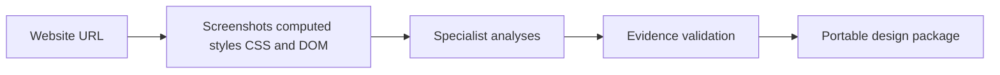

# MYDESIGN.MD

> Research status: **Architecture-level** · Last reviewed: **2026-08-12**

MYDESIGN.MD converts a public website into an evidence-backed design-system package for coding agents. The decisive artifact is plural: a human-readable `DESIGN.md` is accompanied by machine-readable tokens grounding evidence and an audit rather than standing alone as an aesthetic summary.

## Measurement precedes model interpretation

The service crawls a supplied URL and captures screenshots computed styles CSS and DOM structure before asking specialist agents to characterize brand color typography layout and motion. It then checks proposals against the gathered evidence and removes unsupported claims.

This validation step distinguishes the product from a prompt that asks a model to guess a site's style from one screenshot. It still cannot establish original design intent: computed output shows what the deployed page did under the crawler conditions not why a team chose it.

## Eight deliverables divide explanation from execution

The product advertises `DESIGN.md` `design.json` `design-tokens.json` CSS variables a Tailwind configuration an audit a skill file and a grounding artifact. Their roles differ:

| Artifact | Authority role |
|---|---|
| `DESIGN.md` | portable rationale and instructions for a human or agent |
| JSON and token files | structured values for tools and code generation |
| CSS and Tailwind outputs | implementation-oriented materialization |
| audit | disagreements gaps and quality evidence |
| grounding | trace from claims back to observed page evidence |
| skill | packaging that teaches an external agent how to use the result |

The downstream repository remains authoritative for a shipped interface. MYDESIGN.MD owns the extracted context package and job history but does not claim to synchronize later source edits back into the original website or package.

## Evidence ceiling

The product offers browser API and CLI entry points and retains accessible job outputs and favorites. Its crawler implementation model selection prompts evidence-matching thresholds and retention backend are closed. Dynamic states authenticated routes responsive breakpoints and inaccessible assets may therefore be missed; public evidence does not establish complete site coverage or deterministic repeatability.

Team region remains unknown because the reviewed first-party surface did not identify a stable company or maintainer location.

## Primary evidence

- [MYDESIGN.MD product](https://www.mydesignmd.com/)
- [DESIGN.md package examples](https://www.mydesignmd.com/)
