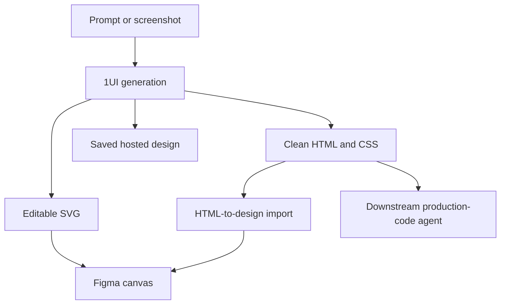

# 1UI

> Research status: **Architecture-level** · Last reviewed: **2026-08-12**

1UI is a prompt- and screenshot-driven UI generator with both a hosted workspace and a Figma-facing path. It deliberately offers several representations—rendered design, HTML/CSS, SVG and native Figma layers—so “editable” must be qualified by which export path is used.

## There are two Figma materialization paths

The current product describes direct generation inside its Figma plugin as editable, ungrouped SVG elements. Separately, hosted 1UI can download “Figma HTML,” which a community HTML-to-design plugin converts into editable layers. These paths should not be assumed to preserve the same component, Auto Layout or token semantics.

Screenshot reconstruction establishes a visual-to-structure transformation, not guaranteed source recovery. Public evidence does not disclose DOM segmentation, responsive breakpoint inference, component extraction, accessibility generation or fidelity evaluation. Likewise, the suggested downstream v0 workflow is a handoff, not evidence that 1UI itself owns the resulting production repository.

Saved designs and sharing establish hosted persistence at product level, but version lineage, export round trips and conflict semantics are not documented. Team geography remains unknown.

## Primary evidence

- [1UI product and export paths](https://www.1ui.dev/)
- [1UI Figma plugin article](https://1ui.dev/blog/figma-plugin)
