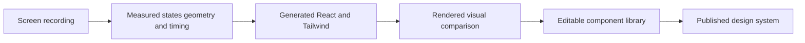

# Replay

> Research status: **Architecture-level** · Last reviewed: **2026-08-12**

Replay treats a screen recording as temporal design evidence and converts it into an executable component system. The recording captures states transitions and timing that a still screenshot would miss; generated React and Tailwind source becomes the durable authority.

## Survey generate and verify

The documented pipeline uses a measurement stage to inspect the recording a generator to materialize components and a quality stage based on visual comparison such as SSIM. The product then exposes a component library documentation a visual canvas and AI edits before publication.

Figma token import can constrain the generated system. A flow map preserves relationships between screens while the visual editor and AI operate on the executable result.

## Temporal evidence is not original source recovery

A recording shows rendered behavior under one exercised path. It cannot reveal unvisited states data contracts accessibility semantics or the original component boundaries. Measurement and SSIM can detect geometric or raster disagreement but not guarantee correct architecture interaction semantics or responsive behavior.

## Evidence ceiling

The current public documentation establishes the pipeline and user surfaces but not the product source. Recording segmentation model prompts component-boundary inference AST strategy SSIM threshold history model and publishing backend remain closed. The dossier therefore classifies Replay as a design-code bridge without calling its reconstruction lossless.

Team region remains unknown on the first-party surface reviewed for this snapshot.

## Primary evidence

- [Replay documentation](https://www.replay.build/docs)
- [Replay product](https://www.replay.build/)
