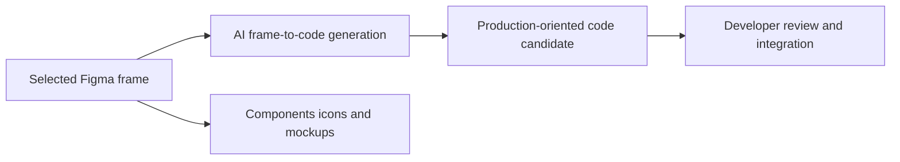

# SparkUI

> Research status: **Architecture-level / current availability not live-verified** · Last reviewed: **2026-08-12**

SparkUI is a Figma plugin suite whose AI-native portion is narrower than its marketing surface: it takes a selected frame and generates code. Component creation, icon browsing and mockup insertion are adjacent deterministic utilities and do not carry the inclusion decision.

## The frame is the input authority; code is a one-way delivery artifact

The creator does not describe a reverse mapping, stable node IDs in code, repository writeback, framework choices, responsive inference, component reuse, correction prompt or preview acceptance loop. The result should therefore be understood as a code candidate derived from a native frame, not a synchronized source representation.

The public announcement and plugin ID `1474891133434707360` establish a February 2025 release. No official website, source repository, changelog or current compatibility statement was found; Figma robots controls prevented direct inspection of the current listing. Lifecycle remains active in the absence of a discontinuation notice, with that evidence limit explicit.

## Primary evidence

- [Creator release and product boundary](https://forum.figma.com/showcase-your-work-14/new-plugin-lauched-welcome-to-sparkui-37884)
- [Figma Community plugin 1474891133434707360](https://www.figma.com/community/plugin/1474891133434707360/sparkui)

Team location remains unknown.
