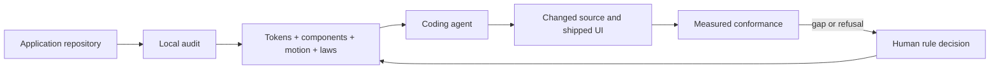

# SynthesisUI

> Research status: **Architecture-level** · Last reviewed: **2026-08-11**

| Field | Value |
|---|---|
| Team | SynthesisUI · team region not established by attributable evidence |
| Ordinary job | audit a shipped interface and compile its design decisions into a contract that coding agents must obey |
| Authority | repository-carried tokens, typed components, motion recipes and usage laws |
| Rendered evidence | live examples and conformance measurement against what actually shipped |

## The Design artifact is an executable contract

SynthesisUI does not position a generated mockup as canonical. It audits an existing repository, extracts its visual system and compiles owned contract files: tokens, typed components, motion and usage laws. Coding agents consume that contract while they change source. Gaps and refusals travel back as explicit rules for a human decision, so governance is part of the correction loop rather than prose attached after generation.

## Source authority stays in the application repository

The product describes its contract as files the user owns. The coding agent still writes the application source, and the rendered product remains a projection of that source. This places SynthesisUI in a design-code bridge form with source-authority/live-projection architecture, rather than treating it as another native canvas.

Its live examples are inspectable rendered sites, which makes the contract testable against output rather than only syntactically valid. The public page says the initial audit runs locally and can be tried without an account. It does not disclose the extraction implementation, contract grammar, scoring weights, patch transport or persistence format, so those details are not inferred.

## Evidence ceiling

The current first-party site establishes the product contract and example outputs but no public implementation repository was located. “Deterministic” and “scored” are retained as product claims; the dossier does not claim formal proof, exact reproducibility across models or complete enforcement against arbitrary agent tools.

## Primary evidence

- [SynthesisUI product](https://synthesisui.com/)
- [Halation live design-system example](https://synthesisui.com/ds/halation)
