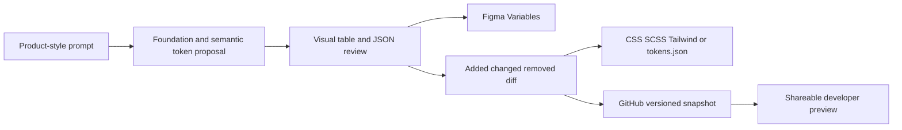

# Tokvista

> Research status: **Architecture-level** · Last reviewed: **2026-08-12**

Tokvista is a Figma plugin that treats a design-token system as a reviewable bridge artifact. AI can propose the initial foundation and semantic graph; designers can inspect and import it into Figma; publishing materializes the same decisions for code and GitHub history.

## Prompted tokens enter a governed lifecycle

The AI generator accepts a product direction such as a dark fintech interface with tight spacing and produces foundation plus semantic token groups. Those tokens are not useful merely as model text: the plugin can import them into Figma Variables and displays them in visual, table and JSON views.

The pre-publish diff separates candidate generation from adoption. A user can see added, changed and removed tokens before writing a new snapshot. That is the decisive human control point and the reason Tokvista is classified under variant decision as well as system governance.

## Artifact authority spans Figma and GitHub without pretending they are one live graph

Local Figma Variables provide the design-side native graph. Export formats and GitHub snapshots materialize the current token decisions for development. Imports can also begin from a `tokens.json` file or URL with alias support. Public evidence does not establish continuous two-way conflict resolution between arbitrary repository changes and the open Figma file; the dossier therefore avoids describing this as a transactional bidirectional sync.

Developer preview links expose resolved tokens without requiring Figma. They are a delivery projection and not a third editing authority.

## Evidence and team boundary

Figma's community listing establishes the released plugin and its Figma-variable/import surface. The creator's first-person technical account establishes the AI generator, diff, exports, GitHub snapshots and preview flow. The implementation is closed, so the model provider, token schema, credential storage and exact snapshot protocol remain unverified.

The creator's public profile places the project maintainer in India. This is recorded as maintainer-region evidence and does not imply an incorporated Tokvista company or a geographically complete team.

## Primary evidence

- [Figma Community plugin](https://www.figma.com/community/plugin/1609493358238428587/tokvista)
- [Creator's technical account of the product](https://dev.to/nibin_dev/tired-of-manually-syncing-design-tokens-so-i-built-a-figma-plugin-4ijj)
- [Creator profile and maintainer location](https://in.linkedin.com/in/nibin-kurian)
