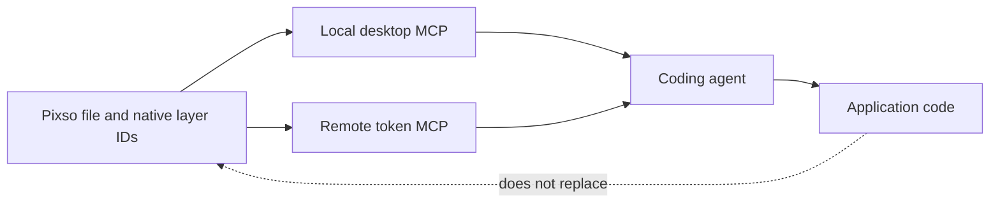

# Pixso

> Research status: **Architecture-level** · Last reviewed: **2026-08-12**

| Field | Value |
|---|---|
| Team | Shenzhen Bosi Yunchuang Technology · Shenzhen China |
| Ordinary job | design a collaborative UI file then let an external coding agent read an exact frame and implement it |
| Authority | Pixso file with native pages layers components styles and variables |
| Agent boundary | local desktop MCP or token-authenticated remote MCP |
| Lifecycle | active |

## Two MCP transports do not create two products

Pixso remains the document owner. In the local path the desktop client exposes an HTTP MCP endpoint and resolves either the selected container or a copied layer link from the active file. In the remote path the cloud service resolves a layer link under a personal access token. Both paths return design context to an IDE agent; neither moves edit authority into Cursor Claude Code or another client.

The public tool contract separates representations by downstream job. `getCode` returns HTML-shaped structure for implementation grounding and `getImage` returns rendered assets. The developer documentation also exposes node DSL variables component and style context. This is a structured design-to-code bridge over a full native editor rather than a screenshot-to-code generator.

## Persistence and delivery

The file keeps the collaborative design graph and its sharing permissions. Components variables and styles remain reusable design-system objects. MCP is an access protocol over that graph; generated application code is a separate materialization and does not become a round-trip replacement for the Pixso document.

## Evidence boundary

The observable contract establishes transport endpoints selection rules and returned representations. It does not expose the proprietary storage schema or server implementation. Pixso AI generation is counted inside this established platform rather than as a second team or product.

## Primary evidence

- [Pixso MCP product surface](https://pixso.cn/mcp/)
- [Local MCP developer guide](https://pre.pixso.cn/developer/en/mcp/local-mcp.html)
- [Remote MCP developer guide](https://pre.pixso.cn/developer/zh/mcp/remote-mcp.html)
- [Pixso team and Shenzhen address](https://pixso.cn/contract-old/)
