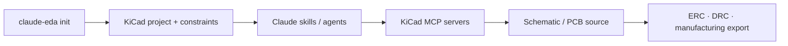

# claude-eda

> Research status: **Source-level** · Lifecycle: **active** · Last reviewed: **2026-08-12**

claude-eda is a project bootstrap and operating contract for Claude Code working on KiCad. It does not embed a model in KiCad; it assembles constraints skills agents and MCP servers so an external agent can enter a recoverable engineering workspace.

## The product is the prepared project boundary

At commit [`59f21a4`](https://github.com/l3wi/claude-eda/tree/59f21a402c5246d6720d6892bddc2347238b2c32) the CLI creates `.claude` instructions MCP configuration project settings and a design-constraints document. Specialized agents cover placement routing schematic organization DRC and manufacturing handoff. The [KiCad MCP command](https://github.com/l3wi/claude-eda/blob/59f21a402c5246d6720d6892bddc2347238b2c32/src/commands/kicad-mcp.ts) manages the external write bridge.

KiCad files and constraint documents remain source; ERC DRC and export results are evidence. The scaffolder adds health checks and repair for environment drift but does not pretend that an LLM can override electrical rules.

The maintainer's first-party profile lists Andorra. Provider and KiCad dependencies mean source inspection proves orchestration but not a paid model run.

## Evidence

- [Repository README](https://github.com/l3wi/claude-eda/blob/59f21a402c5246d6720d6892bddc2347238b2c32/README.md)
- [Constraint schema](https://github.com/l3wi/claude-eda/blob/59f21a402c5246d6720d6892bddc2347238b2c32/templates/claude/skills/eda-architect/reference/CONSTRAINT-SCHEMA.md)
- [Schematic skill](https://github.com/l3wi/claude-eda/blob/59f21a402c5246d6720d6892bddc2347238b2c32/templates/claude/skills/eda-schematics/SKILL.md)
