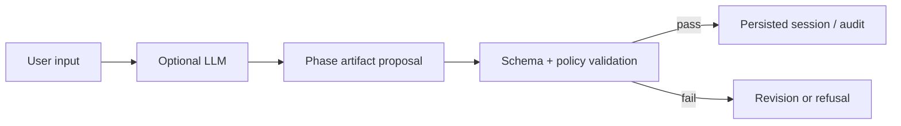

# SPECULA Framework

> Research status: **Source-level** · Lifecycle: **active** · Last reviewed: **2026-08-12**

SPECULA Framework is the executable contract layer of the Specula ecosystem. It turns the methodology's phases ethical gates refusals and governance rules into schemas transition policy storage and an optional LLM-backed command-line runtime.

## Schemas are the constitutional authority

At commit [`452ada8`](https://github.com/oddtitoreal/specula-framework/tree/452ada8f32551a9bf6c19fb3c3cdccdc99836a91) each phase has a JSON Schema and explicit advancement rules. [`orchestrator.py`](https://github.com/oddtitoreal/specula-framework/blob/452ada8f32551a9bf6c19fb3c3cdccdc99836a91/src/specula_agent/orchestrator.py) coordinates a session while [`policy.py`](https://github.com/oddtitoreal/specula-framework/blob/452ada8f32551a9bf6c19fb3c3cdccdc99836a91/src/specula_agent/policy.py) enforces governance rather than allowing model output to advance state by assertion.

A PostgreSQL schema preserves audit and continuity context; a local runtime can operate without claiming a hosted service. Framework is not merged into BOS because it owns technical contract truth while BOS owns the client product architecture.

The first-party maintainer profile establishes Pesaro Italy.

## Pinned evidence

- [Persistence schema](https://github.com/oddtitoreal/specula-framework/blob/452ada8f32551a9bf6c19fb3c3cdccdc99836a91/sql/specula_persistence.sql)
- [Phase 3 refusal schema](https://github.com/oddtitoreal/specula-framework/blob/452ada8f32551a9bf6c19fb3c3cdccdc99836a91/schemas/phase3_refusals.schema.json)
- [Pinned README](https://github.com/oddtitoreal/specula-framework/blob/452ada8f32551a9bf6c19fb3c3cdccdc99836a91/README.md)
