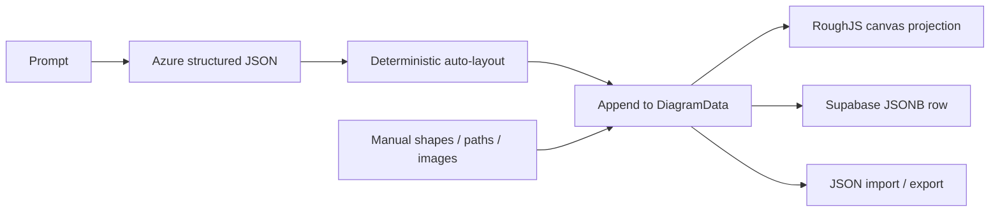

# AI Diagrammer

> Research status: **Source-level** · Lifecycle: **active** · Last reviewed: **2026-08-12**

AI Diagrammer defines generation as adding typed objects to a drawable scene. Azure OpenAI produces nodes and edges; deterministic layout assigns geometry; RoughJS renders them; the user can then mix those generated objects with manual shapes, labels, freehand paths and uploaded images.

## Generation appends to an existing native scene

At commit [`bfc2a48f`](https://github.com/EricTechPro/AI-Diagrammer/tree/bfc2a48f682847ae94f5756d3702b5ec5f91f2e6), [`diagram.ts`](https://github.com/EricTechPro/AI-Diagrammer/blob/bfc2a48f682847ae94f5756d3702b5ec5f91f2e6/src/types/diagram.ts) defines the artifact as `nodes`, `edges` and optional freehand `paths`. [`ai.ts`](https://github.com/EricTechPro/AI-Diagrammer/blob/bfc2a48f682847ae94f5756d3702b5ec5f91f2e6/src/lib/ai.ts) calls an Azure OpenAI-compatible endpoint, parses a constrained JSON object and normalizes missing IDs, dimensions and positions.

[`DiagramEditor`](https://github.com/EricTechPro/AI-Diagrammer/blob/bfc2a48f682847ae94f5756d3702b5ec5f91f2e6/src/components/DiagramEditor.tsx) then applies deterministic auto-layout, offsets the result beyond the rightmost current node and merges it with the existing scene. A second prompt therefore extends rather than silently replaces prior work. There is no AI patch protocol for existing elements; subsequent correction is primarily direct manipulation.

[`Canvas`](https://github.com/EricTechPro/AI-Diagrammer/blob/bfc2a48f682847ae94f5756d3702b5ec5f91f2e6/src/components/Canvas.tsx) edits the same `DiagramData` that AI populated. RoughJS is only the rendering style; the structured scene remains authoritative and round-trips through JSON.

## Recovery is split between transient history and current cloud state

[`useHistory`](https://github.com/EricTechPro/AI-Diagrammer/blob/bfc2a48f682847ae94f5756d3702b5ec5f91f2e6/src/hooks/useHistory.ts) keeps fifty deep scene snapshots in React memory. Each edit also schedules a two-second save to the user's current Supabase diagram row. On reload, the app fetches only the latest updated diagram and resets the local history around that state. The database schema has timestamps but no revision table, so undo depth does not survive a new session.

Uploaded images are stored in a public Supabase bucket and their public URLs become image nodes. That makes image delivery simple, but users should not infer that authenticated diagram ownership also makes uploaded media private.

## The browser is the security boundary

The Azure endpoint and API key are Vite client environment variables, and [`ai.ts`](https://github.com/EricTechPro/AI-Diagrammer/blob/bfc2a48f682847ae94f5756d3702b5ec5f91f2e6/src/lib/ai.ts) sends the key directly from the browser. This is an implemented inference path, but it exposes a provider credential to every built client. The Supabase migration correctly scopes diagram rows by authenticated user; that row-level protection does not repair the separate provider-key boundary.

The verified first-party profile places this project lineage in Canada.

## Why this implementation matters

AI Diagrammer is a compact example of native artifact authoring rather than text-to-image generation. AI-created objects and hand-authored marks coexist in one editable schema, and new generations preserve visible work by appending. Its current frontier is targeted semantic revision: the model can create structured scene fragments, but it cannot yet reason over and patch selected existing objects.

## Evidence

- [Pinned product and architecture contract](https://github.com/EricTechPro/AI-Diagrammer/blob/bfc2a48f682847ae94f5756d3702b5ec5f91f2e6/README.md)
- [Azure generation and schema normalization](https://github.com/EricTechPro/AI-Diagrammer/blob/bfc2a48f682847ae94f5756d3702b5ec5f91f2e6/src/lib/ai.ts)
- [Merge, autosave and JSON round trip](https://github.com/EricTechPro/AI-Diagrammer/blob/bfc2a48f682847ae94f5756d3702b5ec5f91f2e6/src/components/DiagramEditor.tsx)
- [Supabase diagram schema and row policies](https://github.com/EricTechPro/AI-Diagrammer/blob/bfc2a48f682847ae94f5756d3702b5ec5f91f2e6/supabase/migrations/20251017192222_create_diagrams_schema.sql)
