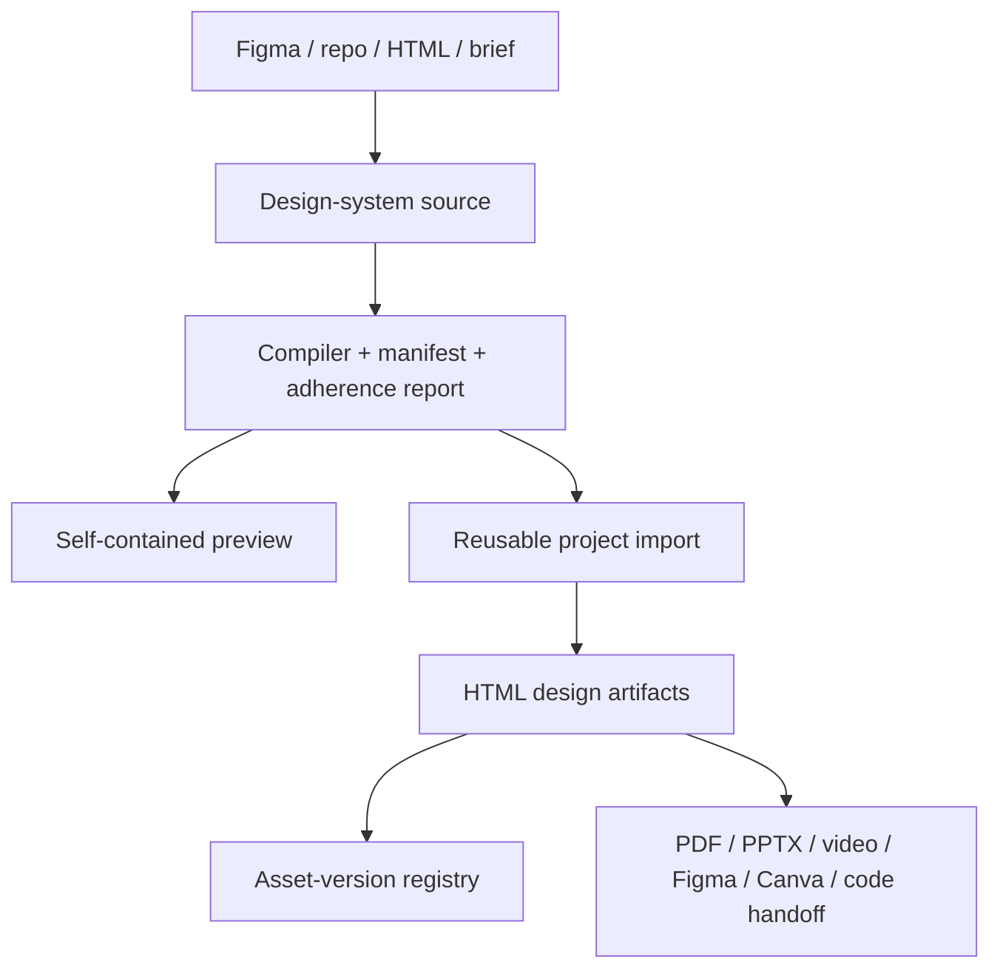

# baoyu-design

> Research status: **Source-level** · Last reviewed: **2026-08-12**

`baoyu-design` demonstrates when an agent skill becomes a design system rather than a prompt collection. It defines an artifact directory, compiles and validates design systems, maintains asset-version metadata, builds a visual preview, ingests sources and exports multiple delivery formats.

## The filesystem protocol

An installed agent reads the core method and only the task-specific built-in skills it needs. Output lands under `designs/<project>/` as self-contained HTML plus assets. Direct source edits remain possible after generation; browser annotation and screenshot checks support a second visual pass.

The most distinctive state is the asset registry. `_d_meta.json` records named assets, paths, versions, inheritance and viewports. Re-recording the same path updates the matching entry; removal is scoped; created and updated timestamps are maintained. This is a real persistence contract for versions, not just advice to “use Git.”

## Design systems are compiled artifacts

The compiler resolves CSS variables, component exports, declaration interfaces and namespace collisions. Import is read-only toward the source design-system directory. The preview builder turns the result into one inspectable HTML document.

## Pinned code and executed evidence

At revision [`026d4ea`](https://github.com/JimLiu/baoyu-design/commit/026d4ea012bdd5cada72ac8cc13f21ba4edf2245):

- [`asset-store.mjs`](https://github.com/JimLiu/baoyu-design/blob/026d4ea012bdd5cada72ac8cc13f21ba4edf2245/skills/baoyu-design/agents/asset-store.mjs) and [`record-asset.mjs`](https://github.com/JimLiu/baoyu-design/blob/026d4ea012bdd5cada72ac8cc13f21ba4edf2245/skills/baoyu-design/agents/record-asset.mjs) implement version metadata.
- [`compile-design-system.mjs`](https://github.com/JimLiu/baoyu-design/blob/026d4ea012bdd5cada72ac8cc13f21ba4edf2245/skills/baoyu-design/agents/compile-design-system.mjs) and [`check-design-system.mjs`](https://github.com/JimLiu/baoyu-design/blob/026d4ea012bdd5cada72ac8cc13f21ba4edf2245/skills/baoyu-design/agents/check-design-system.mjs) implement governance.
- [`build-preview.mjs`](https://github.com/JimLiu/baoyu-design/blob/026d4ea012bdd5cada72ac8cc13f21ba4edf2245/skills/baoyu-design/agents/build-preview.mjs) creates the verification surface.
- Figma ingestion and export/handoff skills sit beside starter components in the [skill tree](https://github.com/JimLiu/baoyu-design/tree/026d4ea012bdd5cada72ac8cc13f21ba4edf2245/skills/baoyu-design).

All 91 test files/cases invoked directly during this review passed, including asset versions, preview generation, design-system compilation, Figma fixture decoding and project-type synchronization. The package's quoted npm glob produced zero tests on Windows, so the audit enumerated the files explicitly rather than accepting that false green.

## Identity and limits

The project is MIT-licensed and independent of Anthropic's closed Claude Design product despite reproducing its method. The maintainer profile gives Chicago as location, supporting a United States team-region label. Model quality and every external export destination were not live-tested.

## Decisive sources

- [Repository README](https://github.com/JimLiu/baoyu-design/blob/026d4ea012bdd5cada72ac8cc13f21ba4edf2245/README.md)
- [MIT license](https://github.com/JimLiu/baoyu-design/blob/026d4ea012bdd5cada72ac8cc13f21ba4edf2245/LICENSE)
- [Maintainer profile](https://github.com/JimLiu)
