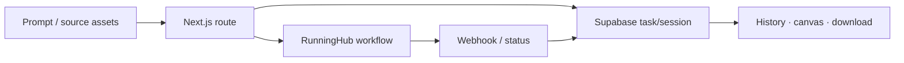

# Boutiqaat Creative Studio

> Research status: **Source-level** · Lifecycle: **active** · Last reviewed: **2026-08-12**

Boutiqaat Creative Studio is a commerce-media production workspace rather than one generic image form. It separates quick campaign creation retouch background removal social resizing video generation bundling and a conversational image agent while retaining user-scoped task history.

## Jobs are first-class records

At commit [`f263d26`](https://github.com/bagzmax7/boutiqaat-gen-app/tree/f263d26065eb5a60c7ada00ec13a5d7c43235023) Next.js routes upload assets to RunningHub start provider workflows and store task or specialized session records in Supabase. Webhook and polling routes reconcile asynchronous completion with the ledger instead of treating a browser spinner as authority.

The image agent has persisted sessions and specialized creative skills. Bundling adds product analysis prompt generation a composition canvas and a catalog session; retouch history preserves before/after pairs and batch delivery. These are separate artifact loops that share one task and identity layer.

The public code proves orchestration and state but not the private provider workflows behind every application ID. Public first-party sources do not establish the team region.

## Evidence

- [Image-agent generation route](https://github.com/bagzmax7/boutiqaat-gen-app/blob/f263d26065eb5a60c7ada00ec13a5d7c43235023/app/api/image-agent/generate/route.ts)
- [Bundling canvas](https://github.com/bagzmax7/boutiqaat-gen-app/blob/f263d26065eb5a60c7ada00ec13a5d7c43235023/components/bundling/GenerationCanvas.tsx)
- [Pinned README](https://github.com/bagzmax7/boutiqaat-gen-app/blob/f263d26065eb5a60c7ada00ec13a5d7c43235023/README.md)
