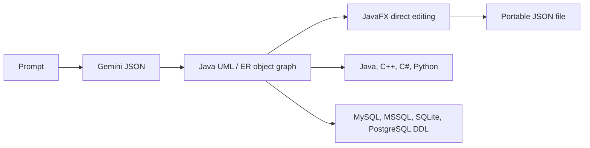

# Codigram

> Research status: **Source-level** · Lifecycle: **active** · Last reviewed: **2026-08-12**

Codigram defines AI-assisted design as bootstrapping a conventional software-modeling object graph. Gemini may create the first UML class diagram or ERD, but Java domain objects—not chat, an image or model prose—become the artifact that the desktop editor and code generators consume.

## Gemini enters through a strict JSON gate

At commit [`1debdce1`](https://github.com/m-ahmad-butt/Codigram/tree/1debdce1fce711d94abc07776743a7b92d424882), [`GeminiAIService`](https://github.com/m-ahmad-butt/Codigram/blob/1debdce1fce711d94abc07776743a7b92d424882/src/main/java/org/example/demo1/service/GeminiAIService.java) calls Gemini 2.0 Flash and requests one of two explicit JSON shapes. It extracts the first JSON object, parses it with Jackson and rejects non-JSON or error responses. [`AIDialogController`](https://github.com/m-ahmad-butt/Codigram/blob/1debdce1fce711d94abc07776743a7b92d424882/src/main/java/org/example/demo1/controller/AIDialogController.java) performs that call off the JavaFX UI thread, validates the result, writes a JSON file and opens the corresponding editor.

This is one-shot delegation rather than an agent loop. The model does not retain tool state or operate the canvas. Its authority ends when the JSON has been accepted into `ClassDiagram`/`UMLClass`/`UMLRelationship` or `ERDiagram`/`ERDEntity`/`ERDRelationship` objects.

## The editable model is also the delivery model

[`DiagramEditorController`](https://github.com/m-ahmad-butt/Codigram/blob/1debdce1fce711d94abc07776743a7b92d424882/src/main/java/org/example/demo1/controller/DiagramEditorController.java) and [`ERDEditorController`](https://github.com/m-ahmad-butt/Codigram/blob/1debdce1fce711d94abc07776743a7b92d424882/src/main/java/org/example/demo1/controller/ERDEditorController.java) let users add, edit and delete entities, attributes, operations and typed relationships. JavaFX canvas views add geometry and resize/move behavior without replacing the semantic model.

[`JsonExportService`](https://github.com/m-ahmad-butt/Codigram/blob/1debdce1fce711d94abc07776743a7b92d424882/src/main/java/org/example/demo1/service/JsonExportService.java) exposes an important source-mapping detail: exports record relationship endpoint names, while imports resolve those names back to regenerated object IDs and assign missing IDs. JSON is therefore a portable semantic snapshot; runtime identity and layout are reconstructed around it.

[`ClassCodeGeneratorService`](https://github.com/m-ahmad-butt/Codigram/blob/1debdce1fce711d94abc07776743a7b92d424882/src/main/java/org/example/demo1/service/ClassCodeGeneratorService.java) and [`ERDCodeGeneratorService`](https://github.com/m-ahmad-butt/Codigram/blob/1debdce1fce711d94abc07776743a7b92d424882/src/main/java/org/example/demo1/service/ERDCodeGeneratorService.java) deterministically materialize that same graph into language files or SQL DDL. This makes code generation a projection of the reviewed artifact, not a second unrelated model request.

## File persistence sets the collaboration boundary

Projects are saved and reopened as user-chosen JSON files. There is no server workspace, autosave log, named version history or merge protocol in the verified source. Git can version exported files, but the application itself treats each save as the current snapshot. The Gemini key is loaded from a packaged `system.properties` resource, which is convenient for a local educational app but is not a secret-management boundary suitable for redistributable builds.

## Why Codigram is distinct

Codigram's contribution is not a novel canvas renderer. It demonstrates a conservative allocation of authority: AI accelerates initial modeling, typed desktop objects support exact human revision, and deterministic generators turn the same reviewed model into implementation scaffolding. Its limitation is equally clear—later changes are manual or a fresh generation, not contextual multi-turn edits against the current graph.

## Evidence

- [Pinned product contract](https://github.com/m-ahmad-butt/Codigram/blob/1debdce1fce711d94abc07776743a7b92d424882/README.md)
- [Gemini request and JSON validation boundary](https://github.com/m-ahmad-butt/Codigram/blob/1debdce1fce711d94abc07776743a7b92d424882/src/main/java/org/example/demo1/service/GeminiAIService.java)
- [Class-diagram JSON round trip](https://github.com/m-ahmad-butt/Codigram/blob/1debdce1fce711d94abc07776743a7b92d424882/src/main/java/org/example/demo1/service/JsonExportService.java)
- [ERD JSON round trip](https://github.com/m-ahmad-butt/Codigram/blob/1debdce1fce711d94abc07776743a7b92d424882/src/main/java/org/example/demo1/service/ERDJsonExportService.java)
