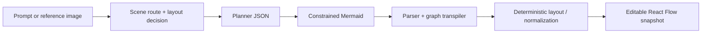

# Flow2Go

> Research status: **Source-level** · Lifecycle: **active** · Last reviewed: **2026-08-12**

Flow2Go defines AI diagramming as a compilation pipeline into a rich native graph editor. The model is deliberately denied final-pixel authority: it routes intent, plans structure and emits Mermaid, while parsers, layout code and React Flow establish the editable artifact.

## Generation is a staged semantic pipeline

At commit [`c86a79a2`](https://github.com/Gusgoooo/Flow2Go/tree/c86a79a26b77437b8fbca8f0582d757797932a5f), [`aiDiagram.ts`](https://github.com/Gusgoooo/Flow2Go/blob/c86a79a26b77437b8fbca8f0582d757797932a5f/src/flow/ai/aiDiagram.ts) uses an OpenAI-compatible Routify gateway for several bounded model calls:

1. a scene router chooses mind-map or flowchart behavior and a layout profile;
2. a diagram planner compresses noisy input into strict structural JSON;
3. a Mermaid generator expresses that plan as constrained source;
4. the local Mermaid parser and transpiler turn source into graph-batch operations;
5. deterministic materialization creates React Flow nodes, containers and edges.

Over-dense flowcharts trigger another constrained generation pass, after which code selects the less complex candidate. Separate paths recognize reference images and swimlanes, but they converge on the same snapshot contract.

The gateway may be reached through a local/dev proxy or directly from the browser depending on deployment. The repository explicitly treats CORS and key placement as deployment concerns rather than hiding them behind a universal hosted backend.

## React Flow becomes authority after compilation

[`FlowEditor.tsx`](https://github.com/Gusgoooo/Flow2Go/blob/c86a79a26b77437b8fbca8f0582d757797932a5f/src/flow/editor/FlowEditor.tsx) applies a generated draft as a complete node/edge replacement, snaps it to the grid and records one undo checkpoint. Users then edit native quad, text, asset and group nodes; manipulate frame parentage and local coordinates; reconnect and style edges; add waypoints; group selections; and rerun layout.

Mermaid is an intermediate representation, not the continuing source of truth. Later visual edits do not regenerate Mermaid. This avoids a false two-way contract and lets the editor preserve native features that the constrained Mermaid subset cannot express.

## Three histories serve different purposes

Flow2Go keeps distinct recovery layers:

- [`projectStorage.ts`](https://github.com/Gusgoooo/Flow2Go/blob/c86a79a26b77437b8fbca8f0582d757797932a5f/src/flow/persistence/projectStorage.ts) stores named current snapshots in browser local storage and overwrites them after a one-second autosave;
- the editor retains up to one hundred undo snapshots in memory;
- [`semanticRunStorage.ts`](https://github.com/Gusgoooo/Flow2Go/blob/c86a79a26b77437b8fbca8f0582d757797932a5f/src/flow/persistence/semanticRunStorage.ts) retains up to two hundred generation bundles, including input metadata, rule-pack identity, semantic payload, raw model text and output snapshot, and can replay a run.

Semantic-run provenance is richer than ordinary undo, but it covers generated runs rather than every manual change. The named project record is current state, not an append-only version graph.

## Portable delivery preserves the native graph

The save/export path produces a ZIP containing `project.json` plus referenced PNG/SVG assets. That manifest includes nodes, edges and viewport, so delivery can preserve editability and custom assets rather than only pixels. Persistence and sharing remain local—there is no mandatory cloud account, realtime collaboration or merge protocol.

Flow2Go contributes a schema-and-compiler definition of AI-native design. Its distinctiveness lies not merely in “LLM to diagram,” but in the series of explicit semantic gates between model output and a graph whose hierarchy, geometry and editing behavior are owned by deterministic code.

## Evidence

- [Pinned architecture summary](https://github.com/Gusgoooo/Flow2Go/blob/c86a79a26b77437b8fbca8f0582d757797932a5f/README.md)
- [Scene router, planner and Mermaid pipeline](https://github.com/Gusgoooo/Flow2Go/blob/c86a79a26b77437b8fbca8f0582d757797932a5f/src/flow/ai/aiDiagram.ts)
- [Native graph application, editing and autosave](https://github.com/Gusgoooo/Flow2Go/blob/c86a79a26b77437b8fbca8f0582d757797932a5f/src/flow/editor/FlowEditor.tsx)
- [Mermaid-to-graph materialization](https://github.com/Gusgoooo/Flow2Go/blob/c86a79a26b77437b8fbca8f0582d757797932a5f/src/flow/mermaid/apply.ts)
