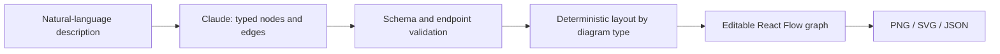

# FlowForge by Krish Jain

> Research status: **Source-level** · Lifecycle: **active** · Last reviewed: **2026-08-12**

FlowForge defines diagram creation as two separable computations: a language model extracts a small semantic graph, then deterministic layout code turns that graph into an editable React Flow scene. The filename `geminiService.js` and parts of the documentation obscure an important implementation fact: the pinned source actually calls Claude through OpenRouter.

## The model proposes topology, not coordinates

At commit [`b23769dd`](https://github.com/krisshhjain/FlowForge/tree/b23769dd83ad914d039f8570549e837ce8956e88), [`geminiService.js`](https://github.com/krisshhjain/FlowForge/blob/b23769dd83ad914d039f8570549e837ce8956e88/server/services/geminiService.js) requests `anthropic/claude-3-haiku` from OpenRouter. It requires JSON with one of five diagram types—linear, tree, cycle, timeline or network—plus nodes and directed edges. The service strips fences, validates that nodes exist and that every edge endpoint resolves, assigns edge IDs and retries malformed responses.

Coordinates are intentionally outside the model contract. [`layoutEngine.ts`](https://github.com/krisshhjain/FlowForge/blob/b23769dd83ad914d039f8570549e837ce8956e88/client/src/utils/layoutEngine.ts) applies Dagre to linear and tree graphs, circular placement to cycles, alternating placement to timelines and hub-and-spoke placement to networks.

This allocation makes layout reproducible and keeps generated semantics independent of viewport geometry.

## Generation replaces; direct manipulation continues

[`EditorPage.tsx`](https://github.com/krisshhjain/FlowForge/blob/b23769dd83ad914d039f8570549e837ce8956e88/client/src/pages/EditorPage.tsx) replaces the current node and edge arrays when a new description is generated and resets the undo state. After that boundary, users can rename and move nodes, add or delete them, and connect or remove edges directly. The model does not operate tools against the live canvas and there is no multi-turn agent memory.

The distinction matters: this is semantic bootstrapping followed by ordinary graph editing, not an autonomous diagram agent. Export is a projection of the reviewed client graph.

## Autosave preserves the latest graph only

The [`Diagram` model](https://github.com/krisshhjain/FlowForge/blob/b23769dd83ad914d039f8570549e837ce8956e88/server/models/Diagram.js) stores the current title, original description, type, positioned nodes and edges in MongoDB. The editor autosaves after five seconds, and dashboard recovery reloads that graph before applying its type-specific layout. Controller updates overwrite the same document.

[`useUndoRedo.ts`](https://github.com/krisshhjain/FlowForge/blob/b23769dd83ad914d039f8570549e837ce8956e88/client/src/hooks/useUndoRedo.ts) retains up to fifty client states, but that history is not persisted as diagram revisions. MongoDB provides current-state recovery, not a durable audit trail or branch model.

## What FlowForge contributes

FlowForge is useful evidence for a compact design definition: language is compiled into validated topology, deterministic algorithms own geometry, and the user owns subsequent graph correction. Its source also demonstrates why repository-level verification matters—the implemented provider and model differ from what the service name suggests.

## Evidence

- [Pinned product overview](https://github.com/krisshhjain/FlowForge/blob/b23769dd83ad914d039f8570549e837ce8956e88/README.md)
- [OpenRouter request and graph validation](https://github.com/krisshhjain/FlowForge/blob/b23769dd83ad914d039f8570549e837ce8956e88/server/services/geminiService.js)
- [Diagram-type layout algorithms](https://github.com/krisshhjain/FlowForge/blob/b23769dd83ad914d039f8570549e837ce8956e88/client/src/utils/layoutEngine.ts)
- [Current-state Mongo model](https://github.com/krisshhjain/FlowForge/blob/b23769dd83ad914d039f8570549e837ce8956e88/server/models/Diagram.js)
