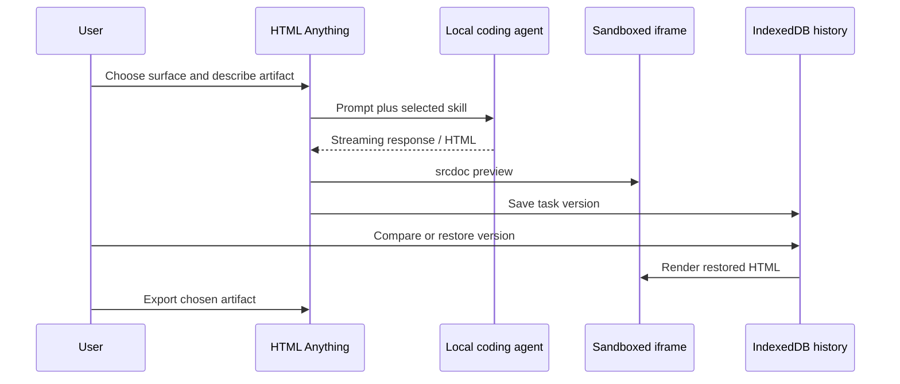

# HTML Anything

> Research status: **Source-level** · Last reviewed: **2026-08-11**

| Field | Value |
|---|---|
| Team | nexu-io / Open Design contributors |
| Ordinary job | ask a local coding agent for a visual artifact, watch it render, compare revisions and export the chosen HTML or platform-specific projection |
| Canonical deliverable | a single-file HTML document |
| Recovery model | per-task versions in browser IndexedDB plus resumable draft/task state |
| Pinned source | [`532bc39f743b97ade9e65fe592b506229f7b01ff`](https://github.com/nexu-io/html-anything/tree/532bc39f743b97ade9e65fe592b506229f7b01ff) |

## Many visual genres share one artifact contract

HTML Anything covers decks, posters, cards, long-form visual documents, dashboards, prototypes and other surfaces through a large skill library. The scope is broad, but the implementation does not invent a different proprietary model for every genre. The agent must return self-contained HTML, and that file is the portable result.

The web application invokes a selected local coding agent, streams progress through its API, extracts HTML from the response and injects it into a sandboxed iframe with `srcdoc`. The user can inspect the artifact while generation is still progressing rather than waiting for an opaque server-side render.

## Preview is isolated from the application shell

Generated HTML may contain scripts and styles. Rendering it in a sandboxed iframe creates an origin and capability boundary between the artifact and the editor shell. That is essential because the source is model-written executable content. The sandbox is not a complete content-security proof—allowed sandbox flags, remote resources and any later download/open context still matter—but it is a concrete separation in the ordinary path.

## Version history belongs to a task, not to Git

The Next.js application stores version records in IndexedDB. The history pane can inspect, restore and compare versions side by side, including large HTML documents. Restoring changes the current task artifact; it does not rewrite an external repository commit or merge concurrent branches. Draft and task metadata also use browser storage, while the CLI path writes the resulting `.html` file directly.

This distinction prevents two common overclaims: browser version history is not durable across every device unless exported or otherwise moved, and a downloaded HTML file does not carry the full task conversation/history unless the user preserves it separately.

## Exporters are projections from HTML

The source includes download, image, clipboard and platform-oriented exporters. Deck-specific and publishing adapters may transform the current document for another destination. Those outputs should be treated as delivery projections. The single-file HTML remains the only representation consistently capable of returning to the live preview and edit loop.

## Evidence map

| Pinned path | What it establishes |
|---|---|
| `next/src/app/api/agents/route.ts` | local-agent invocation boundary |
| `next/src/lib/agents/` | agent detection and process execution |
| `next/src/lib/parsers/` | extraction of generated HTML |
| `next/src/lib/history/db.ts` | IndexedDB version schema and retention operations |
| `next/src/components/history-pane.tsx` | inspect, compare and restore user journey |
| `next/src/lib/export/` | delivery projections from current HTML |
| `next/src/lib/templates/skills/` | genre-specific design instructions without changing the core artifact type |

## Product boundary

HTML Anything is counted separately from the broader Open Design workspace because it ships a focused ordinary-user application, persistence model and export system around a single-file HTML authority. Shared maintainers and skills do not erase that distinct workflow. Conversely, each bundled template is not counted as a separate product.

## Primary evidence

- [Pinned repository](https://github.com/nexu-io/html-anything/tree/532bc39f743b97ade9e65fe592b506229f7b01ff)
- [Pinned history database](https://github.com/nexu-io/html-anything/blob/532bc39f743b97ade9e65fe592b506229f7b01ff/next/src/lib/history/db.ts)
- [Pinned export implementation](https://github.com/nexu-io/html-anything/tree/532bc39f743b97ade9e65fe592b506229f7b01ff/next/src/lib/export)
