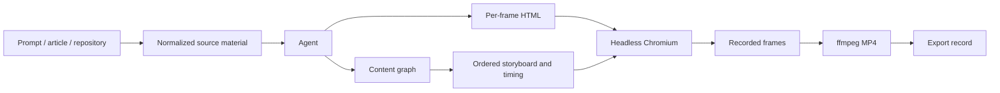

# HTML Video

> Research status: **Source-level** · Last reviewed: **2026-08-11**

| Field | Value |
|---|---|
| Team | nexu-io / Open Design contributors |
| Ordinary job | turn a prompt, article or repository into a multi-scene video, correct its frames and render an MP4 |
| Authoring authority | project JSON, a content-graph storyboard and per-frame HTML files |
| Delivery authority | timestamped rendered video exports |
| Pinned source | [`c414ecc07f795add03807d5d9ce4baefd807cea2`](https://github.com/nexu-io/html-video/tree/c414ecc07f795add03807d5d9ce4baefd807cea2) |

## Story structure is made explicit before recording

HTML Video does not ask a model for one opaque video blob. Source material is fetched and normalized, then the agent emits a content graph and one HTML block per frame. Graph nodes represent entities, data or text; edges express sequence, dependency or contrast. Topological order and duration turn that graph into a storyboard.

This intermediate representation is the project's distinctive boundary. A user can inspect frame order and text, revise a frame or regenerate the storyboard without decoding an MP4. Single-frame jobs can skip the graph, but the multi-frame path retains semantic structure throughout production.

## The project directory is the production record

A project under `.html-video/projects/<id>/` contains `project.json`, `content-graph.json`, `frames/*.html`, assets and outputs. `ProjectStore` uses JSON-on-disk storage. Project state records stages such as draft, previewed and rendered, remembers the most recent preview/output and appends export records.

The authoring state and delivery state are therefore related but not interchangeable. An exported MP4 is evidence of one render; the project directory is what allows the user or agent to revise content and render again.

## “Hyperframes” is implemented as browser recording

At the pinned revision the concrete Hyperframes adapter loads HTML in Playwright/Chromium, waits for resources and fonts, records browser output, then uses ffmpeg/libx264 to encode MP4. The adapter name should not be mistaken for a proprietary rendering engine. Remotion bridge code also exists, but support claims must follow the actually selected and validated adapter path.

Because HTML is executable, remote assets, fonts, animation timing and browser determinism all affect output. Validation catches missing source and capability mismatches, but it cannot guarantee that arbitrary generated HTML is visually correct or safe. A production deployment should isolate untrusted content and pin external assets where reproducibility matters.

## Correction happens above the video layer

The studio exposes per-frame text editing, reordering and re-rendering. Those operations change the graph/frame sources and then produce a new delivery artifact. They do not attempt pixel-level editing of the prior MP4. This preserves a comprehensible correction loop: modify intent or HTML, preview, then adopt a new render.

## Commit-level evidence map

| Pinned path | Evidence |
|---|---|
| `packages/content-graph/` | storyboard node/edge model and ordering |
| `packages/core/src/project.ts` | project lifecycle and export metadata |
| `packages/cli/src/fetch-source.ts` | prompt/article/repository ingestion boundary |
| `packages/cli/src/studio-server.ts` | project APIs, agent exchange and frame correction |
| `packages/adapter-hyperframes/src/render.ts` | Playwright recording and ffmpeg materialization |
| `packages/project-studio/` | ordinary visual review/editing surface |

## What is not established

The source does not establish frame-level collaborative merging, a content-addressed immutable version graph or guaranteed deterministic replay across Chromium/ffmpeg versions. Export history points to outputs but is not a substitute for versioning every input asset and toolchain component.

## Primary evidence

- [Pinned repository](https://github.com/nexu-io/html-video/tree/c414ecc07f795add03807d5d9ce4baefd807cea2)
- [Pinned project model](https://github.com/nexu-io/html-video/blob/c414ecc07f795add03807d5d9ce4baefd807cea2/packages/core/src/project.ts)
- [Pinned Hyperframes adapter](https://github.com/nexu-io/html-video/blob/c414ecc07f795add03807d5d9ce4baefd807cea2/packages/adapter-hyperframes/src/render.ts)
