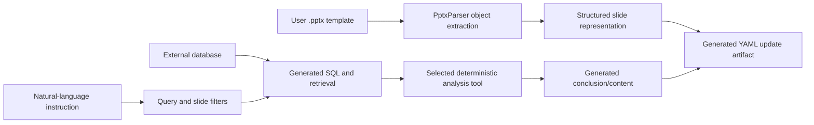

# SlideAgent / DynaSlide (`XiaoZhou2024/SlideAgent`)

> Research status: **Source-level** · Last reviewed: **2026-08-11**

| Field | Value |
|---|---|
| Organization / team | Beijing Normal University research team |
| Research task | update data-heavy user-authored slide templates from natural-language instructions while preserving their layout and style |
| Released artifact | parsed PowerPoint structure, retrieved/processed data and generated YAML slide-update representation |
| Status | active research release; the published code is a reference implementation rather than a polished end-user editor |
| Source repository | [XiaoZhou2024/SlideAgent](https://github.com/XiaoZhou2024/SlideAgent) |
| Pinned source revision | [`c6ddcc157f435e91a2b1675e258cacd5cb720367`](https://github.com/XiaoZhou2024/SlideAgent/commit/c6ddcc157f435e91a2b1675e258cacd5cb720367) |

## The paper's target and the released authority are not identical

The [DynaSlide paper](https://arxiv.org/html/2604.17894v1) defines a demanding job: bring a user-provided PowerPoint template, interpret an update request, retrieve current business data, and update tables, charts and conclusions without destroying the original design.

The pinned repository implements much of the reasoning and representation pipeline, but its main executable path ends at generated YAML rather than writing a final `.pptx`. That distinction is central to an honest dossier.

The research result evaluates slide updating; the public code exposes the structured plan and evidence needed for that update. It does not justify claiming that an ordinary user can run this snapshot and receive a saved native deck from the checked-in `main.py` path.

## PowerPoint is parsed as objects, not flattened screenshots

`pptx_parser.py` and `pptx_parser2.py` use `python-pptx` to inspect slide objects. The parser distinguishes text, tables, charts, positions and dimensions. Rendering utilities can convert decks through PDF/images, and the analysis path can fuse visual layout labels with object geometry using intersection-over-union.

This gives the agent two kinds of evidence:

- **structural evidence:** object types, text, chart/table data and numeric geometry;
- **visual evidence:** rendered layout regions and labels used to interpret composition.

The structural representation remains the editable planning substrate. Rendered pixels help identify roles and layout; they do not replace the slide object model.

## Instruction grounding becomes data operations

`YamlProcessor` coordinates the released workflow. Prompt stages identify query filters and slide filters. `sql_generator.py` turns those constraints into database queries. `database_manager.py` executes retrieval and writes intermediate data. `tools_selector.py` chooses an analysis function, and `conclusion_generator.py` produces text grounded in the retrieved results.

That mechanism is more specific than generic “LLM edits a slide” language. A valid update has to preserve a chain:

1. the instruction identifies which business slice and slide content should change;
2. SQL retrieves the corresponding data;
3. a named analysis operation transforms it;
4. conclusions are grounded in the computed result;
5. the structured output retains the target slide's content and layout roles.

A plausible-looking chart with the wrong query would fail even if its screenshot passed a visual review.

## Generated YAML is the released handoff point

`yaml_processor.py` builds an `output_slide` object and writes a file named from the ground-truth task with a `_generated_120b.yaml` suffix. The same run creates timestamped/intermediate data directories and processed spreadsheet files.

The YAML captures the agent's proposed slide state in a reproducible form, but it is an intermediate authority relative to the paper's native-deck goal. The public snapshot does not include a main-path applier that maps every generated field back to PowerPoint objects and saves the new presentation.

Consequences:

- source evidence supports structured slide-update generation;
- paper evaluation can compare generated structure with target structure;
- native PowerPoint round-trip fidelity is not established by the repository;
- PowerPoint history, comments and host undo are not part of this implementation's recovery model.

## Persistence is task-directory based

There is no project database or user-facing version graph in the release. Persistence consists of input paths plus generated files:

| Persisted material | Purpose |
|---|---|
| source `.pptx` | user-authored template and layout source |
| ground-truth / parsed YAML | task representation and evaluation reference |
| retrieval CSV / processed XLSX | data provenance and analysis intermediates |
| generated YAML | proposed updated slide state |

Re-running can create another generated file, but the project does not implement semantic branch, merge, restore or conflict handling. A production system built from this research would need to define which generated representation was accepted and how it was applied to the host document.

## Implementation map

| Concern | Pinned path | Evidence |
|---|---|---|
| entry and batch execution | `main.py` | scans task data and invokes `YamlProcessor` |
| PowerPoint parsing | `pptx_parser.py`, `pptx_parser2.py` | object structure, geometry and render-assisted layout parsing |
| workflow authority | `yaml_processor.py` | filter → query → tool → conclusion → YAML sequence |
| query generation | `sql_generator.py` | natural-language constraints become executable data retrieval |
| database provenance | `database_manager.py` | retrieves and saves data used by the slide update |
| analytical operations | `tool_functions.py`, `tools_selector.py` | bounded functions selected for data transformation |
| generated narrative | `conclusion_generator.py` | content derived from query and analysis outputs |

## Commit-level evidence and limits

The repository has only a small public history. The pinned revision `c6ddcc157f435e91a2b1675e258cacd5cb720367` is therefore an implementation snapshot, not evidence of a mature release cadence. It contains the full checked-in research pipeline described above.

The remaining acceptance gap is concrete: add or locate the native-object applier, run one user-supplied deck through it, reopen the result in PowerPoint, verify data and layout, then test a second update and recovery. Until that evidence exists, the dossier stops at the YAML authority actually shipped.

## Primary evidence

- [Pinned repository](https://github.com/XiaoZhou2024/SlideAgent/tree/c6ddcc157f435e91a2b1675e258cacd5cb720367)
- [Automatic Slide Updating with User-Defined Dynamic Templates and Natural Language Instructions](https://arxiv.org/html/2604.17894v1)
- [Repository README](https://github.com/XiaoZhou2024/SlideAgent/blob/c6ddcc157f435e91a2b1675e258cacd5cb720367/README.md)
