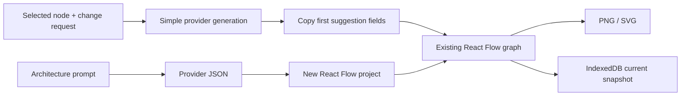

# TechDraw

> Research status: **Source-level** · Lifecycle: **active** · Last reviewed: **2026-08-12**

TechDraw defines AI architecture design as structured React Flow authoring with a large technology-icon vocabulary. The model creates a graph that remains a first-class local project; a narrower path can also reinterpret one existing node without regenerating the rest of the canvas.

## The current source supports three provider routes

At commit [`eb9a1277`](https://github.com/SaiDhinakar/TechDraw/tree/eb9a12773701e1f13c958b9ab3cc7a2800fbec14), [`ai.ts`](https://github.com/SaiDhinakar/TechDraw/blob/eb9a12773701e1f13c958b9ab3cc7a2800fbec14/src/lib/ai.ts) implements OpenRouter, Groq and Gemini—not the four direct OpenAI/Anthropic/Gemini/Groq integrations described by the README. It sends a constrained React Flow JSON schema, diagram-specific layout rules and up to 150 available icon names. Responses are normalized into custom nodes and edges; malformed JSON falls back to a small deterministic diagram rather than preserving a visibly failed generation state.

Whole-diagram generation creates a new persisted project. Context-menu modification follows a different route in [`DiagramEditor`](https://github.com/SaiDhinakar/TechDraw/blob/eb9a12773701e1f13c958b9ab3cc7a2800fbec14/src/components/DiagramEditor.tsx): it sends the selected node's title and content plus the requested change through the same generator, then copies title, content and icon from the first returned node onto the original ID. Geometry, edges and all unselected nodes remain under human control.

This is context-aware at node scope, not graph-wide agentic revision. The general toolbar's AI button opens the full generator; the implemented targeted path is reached from an individual node's context menu.

## Local-first means three different kinds of local state

[`storage.ts`](https://github.com/SaiDhinakar/TechDraw/blob/eb9a12773701e1f13c958b9ab3cc7a2800fbec14/src/lib/storage.ts) stores named diagram records, icons and preferences in IndexedDB, with localStorage fallback. The artifact record contains nodes, edges and viewport and is overwritten on save; there is no durable revision table. [`historyManager.ts`](https://github.com/SaiDhinakar/TechDraw/blob/eb9a12773701e1f13c958b9ab3cc7a2800fbec14/src/lib/historyManager.ts) separately holds fifty deep graph snapshots in memory for undo and redo.

The source does not implement the README's claimed persistent autosave. Node and edge changes feed an in-memory history callback, while `TechDrawApp` passes an explicit `onSave` handler and no `onDiagramChange` persistence handler to the editor. Generated diagrams are saved immediately; ordinary edits become durable when the user presses Save.

Provider keys form the third local state. [`settings.ts`](https://github.com/SaiDhinakar/TechDraw/blob/eb9a12773701e1f13c958b9ab3cc7a2800fbec14/src/lib/settings.ts) stores them inside browser preferences, and the OpenAI-compatible clients are configured with `dangerouslyAllowBrowser`. “Local-first” here accurately describes artifact storage, but prompts and keys still cross browser-to-provider boundaries.

The verified first-party profile places TechDraw's project lineage in India.

## Why TechDraw is a distinct implementation

TechDraw combines a domain-specific icon catalog with native graph editing and a small, explicit AI-to-existing-artifact mapping. Its most useful evidence is the difference between marketing contract and executable contract: provider coverage and autosave are narrower in source, while per-node AI mutation is more concrete than a generic “context-aware” claim. The result is a local architecture workspace whose current limitation is whole-graph reasoning and versioned recovery.

## Evidence

- [Pinned product claims](https://github.com/SaiDhinakar/TechDraw/blob/eb9a12773701e1f13c958b9ab3cc7a2800fbec14/README.md)
- [Implemented provider and JSON-normalization layer](https://github.com/SaiDhinakar/TechDraw/blob/eb9a12773701e1f13c958b9ab3cc7a2800fbec14/src/lib/ai.ts)
- [Targeted node mutation and explicit save boundary](https://github.com/SaiDhinakar/TechDraw/blob/eb9a12773701e1f13c958b9ab3cc7a2800fbec14/src/components/DiagramEditor.tsx)
- [IndexedDB project model](https://github.com/SaiDhinakar/TechDraw/blob/eb9a12773701e1f13c958b9ab3cc7a2800fbec14/src/lib/storage.ts)
