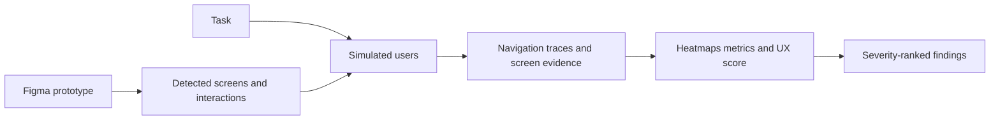

# Behavr

> Research status: **Architecture-level** · Last reviewed: **2026-08-12**

Behavr is a simulated-user usability-testing workspace. Its artifact is not the Figma file itself and its agents do not rewrite that file. The retained object is a study: an extracted prototype flow plus agent sessions metrics heatmaps and findings that a designer can use when deciding what to change.

## A prototype becomes a testable state graph

The ordinary user supplies a Figma prototype URL. Behavr identifies screens and configured interactions and gives AI users a task. Each simulated user navigates the available flow rather than merely critiquing a screenshot. The product then aggregates success rate drop-off misclicks time and screen-level reasoning.

This makes Behavr a Design-evidence system rather than a native authoring tool. A suggested fix remains an analytical claim until a person changes the source design and validates the result.

## The report has several evidence levels

| Result | What is established | What is not established |
|---|---|---|
| navigation trace | the simulated agent took a particular path through the exposed prototype | a real target user would behave identically |
| heatmap and misclick data | model-driven sessions concentrated interaction at particular locations | statistically representative human attention |
| screen reasoning | the agent supplied an explanation associated with a step | ground-truth user motivation |
| ranked finding | the product synthesized a repair priority | that the proposed repair improves the production experience |

Behavr itself draws this boundary by recommending real-user validation for critical decisions. That disclosure is part of the architecture: simulation increases the number of inspectable trials but does not turn synthetic evidence into human research.

## Persistence and unknowns

The current product presents a retained result surface for a study. Public material does not disclose the prototype parser graph schema agent prompt model routing sampling controls storage retention or whether two runs can be reproduced from a fixed seed. It also does not establish a writeback API to Figma. Those internals remain unknown rather than being inferred from the visible heatmaps.

Team region remains unknown: no first-party company or maintainer location was found in the evidence reviewed for this snapshot.

## Primary evidence

- [Behavr product](https://behavr.ai/)
- [Behavr test workflow](https://behavr.ai/)
