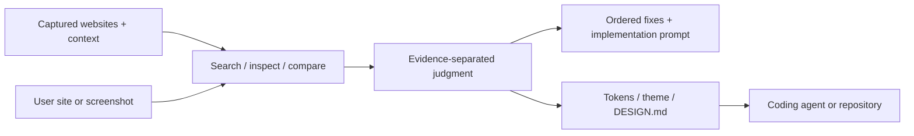

# Fudge

> Research status: **Architecture-level / available public boundary reached** · Last reviewed: **2026-08-12**

Fudge defines Design as reference-grounded inspection and correction. It captures a live website in enough detail for an agent to compare it with relevant precedents, explain what is different and turn that analysis into concrete implementation guidance.

## The retained evidence is richer than a screenshot

For a supplied URL or screenshot, Fudge can preserve the page, screenshots, typography, colors, spacing, layout, media and capture context; video and interaction evidence can be retained when motion matters. The user can search the corpus by industry, page type, layout, font, color, domain, screenshot or visual direction.

That evidence supports four ordinary journeys:

1. find comparable references;
2. inspect a site on desktop and mobile;
3. compare directions and choose a fitting pattern;
4. produce ordered fixes, tokens, CSS variables, Tailwind themes, structured JSON or `DESIGN.md`.

The web chat and MCP server expose the same design-research loop to humans and coding agents.

## Authority is a provenance chain

Fudge does not directly become the application's source authority. It owns the capture/provenance and review artifact; the coding agent applies accepted guidance to a separate codebase.

## Public-output repository

The product implementation is closed, but a public MIT repository provides an unusually large output audit. At commit [`185cdff`](https://github.com/scroobius-pip/fudge-design-md/commit/185cdffdd1906f6cb177ac789a34c31d1bebf582), accepted per-domain guides:

- separate captured facts from interpretation;
- link the Fudge conversation and captured pages;
- include representative page images;
- are synchronized only when an accepted share exists;
- exclude thin drafts and record blocked or failed migrations.

[`scripts/sync.mjs`](https://github.com/scroobius-pip/fudge-design-md/blob/185cdffdd1906f6cb177ac789a34c31d1bebf582/scripts/sync.mjs) fetches accepted shares, validates the expected domain/share key and updates the index. [`status/STATUS.md`](https://github.com/scroobius-pip/fudge-design-md/blob/185cdffdd1906f6cb177ac789a34c31d1bebf582/status/STATUS.md) preserves migration outcomes rather than presenting every attempted domain as complete.

## Evidence ceiling

The first-party site establishes current plans, capture fields, MCP availability and output forms. The public repository verifies outputs and synchronization but is not the closed product source, so the dossier remains Architecture-level. No reliable public team-region evidence was found.

## Decisive sources

- [First-party product page](https://design.withfudge.com/)
- [Public DESIGN.md collection](https://github.com/scroobius-pip/fudge-design-md)
- [Pinned collection README](https://github.com/scroobius-pip/fudge-design-md/blob/185cdffdd1906f6cb177ac789a34c31d1bebf582/README.md)
- [Collection MIT license](https://github.com/scroobius-pip/fudge-design-md/blob/185cdffdd1906f6cb177ac789a34c31d1bebf582/LICENSE)
