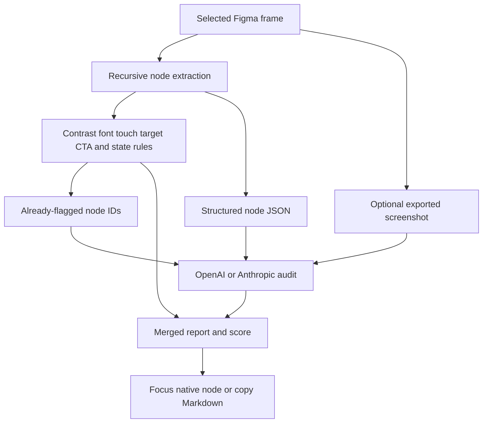

# Heuristic AI

> Research status: **Source-level** · Last reviewed: **2026-08-12**

| Field | Verified value |
|---|---|
| Product | Heuristic AI / AI UX Audit Figma plugin |
| Canonical artifact | merged node-addressed audit report; the selected Figma frame remains design authority |
| Pinned source | [`11e19745d13a6da6060d19f140f3742bb8127097`](https://github.com/donghuc/heuristic-ai/tree/11e19745d13a6da6060d19f140f3742bb8127097) |
| License | no license file or package license declaration at the pinned revision |

Heuristic AI audits a selected Figma frame using two evidence paths: deterministic checks over extracted node facts and a model review over structured JSON with an optional screenshot. Results are merged into one score and issue list whose items can focus the corresponding canvas node.

## Deterministic rules run before the model

The deterministic registry currently checks contrast, font size, touch targets, multiple primary CTAs and missing states. It supplies already-flagged IDs to the model to reduce duplicate findings. Screenshot inclusion is an explicit user setting; oversized or failed exports fall back to structured facts.

The model prompt asks for heuristic and accessibility issues in structured form. Provider adapters support OpenAI and Anthropic, parse responses and retry failures. The UI groups issues by category, supports node focus and converts the report to Markdown for clipboard export.

## Mutation is not yet the ordinary-user authority

Some deterministic issues carry `autoFix` descriptions in the type model, but the reviewed UI and main-message contract do not implement an apply-fix action. This is therefore an evidence and review workspace, not an auto-repair agent. Figma remains authoritative and the report coordinates later human changes.

## Source map

| Pinned path | Decisive evidence |
|---|---|
| [`src/main.ts`](https://github.com/donghuc/heuristic-ai/blob/11e19745d13a6da6060d19f140f3742bb8127097/src/main.ts) | selection traversal, screenshot export, rule/model sequencing and node focus |
| [`src/rules/index.ts`](https://github.com/donghuc/heuristic-ai/blob/11e19745d13a6da6060d19f140f3742bb8127097/src/rules/index.ts) | deterministic registry |
| [`src/services/prompt.builder.ts`](https://github.com/donghuc/heuristic-ai/blob/11e19745d13a6da6060d19f140f3742bb8127097/src/services/prompt.builder.ts) | model rubric and JSON contract |
| [`src/services/ai.service.ts`](https://github.com/donghuc/heuristic-ai/blob/11e19745d13a6da6060d19f140f3742bb8127097/src/services/ai.service.ts) | provider dispatch |
| [`src/ui/components/ResultsScreen.tsx`](https://github.com/donghuc/heuristic-ai/blob/11e19745d13a6da6060d19f140f3742bb8127097/src/ui/components/ResultsScreen.tsx) | category review, Markdown export and node targeting |

The repository has no tests or license grant in the pinned tree. Audit quality, prompt stability, model nondeterminism and privacy remain limitations. Team region is unknown.

## Primary evidence

- [Pinned repository](https://github.com/donghuc/heuristic-ai/tree/11e19745d13a6da6060d19f140f3742bb8127097)
- [Figma Community listing](https://www.figma.com/community/plugin/1611243044519322138)
