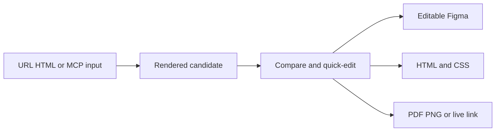

# Hyperplane

> Research status: **Architecture-level** · Last reviewed: **2026-08-12**

Hyperplane sits between AI-generated HTML and the artifact a team is ready to adopt. Its central mechanism is candidate rendering and promotion rather than autonomous generation.

## Input is cheap; adoption is explicit

A design can start from a scanned URL pasted HTML or an MCP request. Hyperplane renders that input as a live visual on a canvas. Teams can place multiple alternatives side by side compare them and decide which direction is worth carrying forward.

Small corrections stay in the decision surface: text can be rewritten and images swapped directly. More complex work is promoted to one of several outputs:

- editable Figma layers and text for continued visual design;
- clean HTML and CSS for implementation;
- PDF or PNG for review and communication;
- a live link for sharing.

## Authority boundary

The imported HTML and hosted rendered design together carry the current candidate. Export creates a new authority suited to the next role; the public surface does not claim a synchronized Figma-code round trip. Hyperplane therefore differs from Backdraft which patches existing source directly and from a native design editor which owns the canonical layer graph.

The pricing contract counts each URL HTML block or MCP request as one design and gives all export formats in both tiers. That operational unit reinforces the candidate-oriented product model.

## Primary evidence

- [Hyperplane product workflow](https://hyperplane.design/)
- [Hyperplane pricing and design unit](https://hyperplane.design/pricing)
- [Hyperplane canvas workflow anchor](https://hyperplane.design/#how-it-works)
