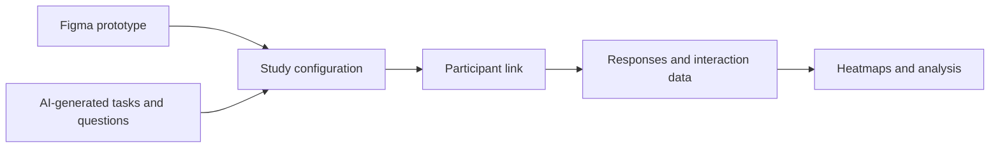

# Sio

> Research status: **Architecture-level** · Last reviewed: **2026-08-12**

Sio is an AI-assisted usability-study product. It qualifies through the full study lifecycle visible in its current application distribution: prototype grounding task and questionnaire generation participant collection heatmaps and analysis are retained as one project rather than emitted as an isolated critique.

## The study is the artifact

The ordinary path begins with a Figma prototype and a research intent. Sio's assistant proposes a study plan and questions. The product creates participant-facing links collects responses and interaction evidence and turns them into UX findings.

This architecture differs from a purely simulated-user tool. Sio can generate research scaffolding but the participant response remains a separate human evidence source. The AI interpretation does not replace the raw observations.

## Distribution evidence and limits

The public landing page exposes little machine-readable detail. The reviewed current JavaScript application bundle identifies the UX-research assistant path Figma embedding task generation participant links data collection heatmaps and analysis. Because the source is not published the dossier treats those as observable distribution contracts and does not infer the internal data schema or model prompts.

Unknowns include prototype-access permissions interaction capture instrumentation study-versioning retention participant consent model provider and whether analysis can be regenerated against the same raw dataset. No public source establishes a writeback path to Figma.

Team region remains unknown in the reviewed first-party evidence.

## Primary evidence

- [Sio application](https://usesio.app/)
- [Current Sio web distribution](https://usesio.app/assets/index-CAdVh0Z_.js)
