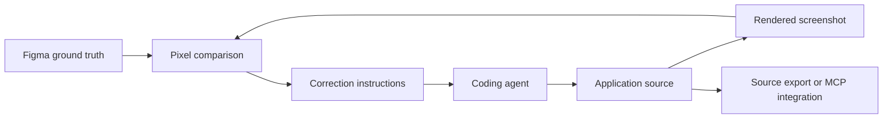

# Visdiff

> Research status: **Architecture-level** · Last reviewed: **2026-08-11**

| Field | Value |
|---|---|
| Team | Visdiff · team region not established |
| Ordinary job | make agent-written frontend code visually converge on a selected Figma frame |
| Design authority | the referenced Figma design |
| Mutable authority | generated application source and its rendered output |
| Lifecycle | macOS early access |

## The screenshot is feedback not the artifact

Visdiff treats Figma as ground truth. An agent generates code the system renders that code to pixels and a pixel comparison becomes correction evidence for another pass. The user receives the resulting modern web source or integrates the correction loop into an existing codebase through MCP.

This differs from visual regression testing because the diff is inside an authoring loop. It also differs from screenshot-to-code generation because the original structured design remains the explicit target and repeated rendered evidence governs revision.

## Two authorities remain deliberately unequal

Figma answers what the interface should look like. Source answers what actually executes. Visdiff attempts convergence but does not claim that the code can reconstruct the Figma document or preserve interaction semantics that are absent from the frame.

## Evidence ceiling

The public early-access page does not disclose comparison thresholds browser and viewport controls masking font determinism patch selection loop limits history or how MCP writes are authorized. “Pixel-perfect” is therefore a product objective rather than an independently verified guarantee.

## Primary evidence

- [Visdiff product and three-step loop](https://visdiff.com/)
- [Visdiff how-it-works section](https://visdiff.com/#how-it-works)
- [Visdiff early-access download](https://visdiff.com/#download)
