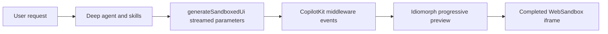

# Open Generative UI

> Research status: **Source-level** · Last reviewed: **2026-08-12**

| Field | Verified value |
|---|---|
| Maintainer | CopilotKit |
| Artifact | streamed HTML CSS JavaScript-function and expression parameters rendered in an isolated UI surface |
| Human result | live HTML SVG WebGL chart or widget with export support |
| License | MIT |
| Pinned source | [`457e60cdf7f63fb78004486e1dc7ba753194696d`](https://github.com/CopilotKit/OpenGenerativeUI/tree/457e60cdf7f63fb78004486e1dc7ba753194696d) |

Open Generative UI is a runnable reference system for free-form generative interfaces. It differs from catalog protocols such as A2UI: the model supplies web artifact content and the runtime contains that content in a sandbox rather than resolving only pre-approved abstract component names.

## Streaming is ordered artifact construction

The canonical `generateSandboxedUi` tool receives ordered streaming fields: initial height placeholder messages CSS HTML JavaScript functions and JavaScript expressions. CopilotKit middleware translates partial tool events to the renderer. During generation `process-partial-html` prepares incomplete markup and Idiomorph patches the preview without replacing the full DOM on every token.

The progressive view is provisional. A final frame is rebuilt through the WebSandbox loader and becomes the stable executable result for that generation.

## Source map

| Pinned path | Mechanism |
|---|---|
| [`apps/app/src/components/generative-ui/open-generative-ui/schema.ts`](https://github.com/CopilotKit/OpenGenerativeUI/blob/457e60cdf7f63fb78004486e1dc7ba753194696d/apps/app/src/components/generative-ui/open-generative-ui/schema.ts) | streamed tool parameter contract |
| [`renderer.tsx`](https://github.com/CopilotKit/OpenGenerativeUI/blob/457e60cdf7f63fb78004486e1dc7ba753194696d/apps/app/src/components/generative-ui/open-generative-ui/renderer.tsx) | progressive and completed render orchestration |
| [`process-partial-html.ts`](https://github.com/CopilotKit/OpenGenerativeUI/blob/457e60cdf7f63fb78004486e1dc7ba753194696d/apps/app/src/components/generative-ui/open-generative-ui/process-partial-html.ts) | incomplete-stream repair for preview |
| [`websandbox-loader.ts`](https://github.com/CopilotKit/OpenGenerativeUI/blob/457e60cdf7f63fb78004486e1dc7ba753194696d/apps/app/src/components/generative-ui/open-generative-ui/websandbox-loader.ts) | isolated final runtime loading |
| [`apps/mcp/src/`](https://github.com/CopilotKit/OpenGenerativeUI/tree/457e60cdf7f63fb78004486e1dc7ba753194696d/apps/mcp/src) | MCP renderer skills and document-assembly surface |
| [`apps/agent/`](https://github.com/CopilotKit/OpenGenerativeUI/tree/457e60cdf7f63fb78004486e1dc7ba753194696d/apps/agent) | agent prompts skills and bounded memory |

## Sandbox is a boundary not a quality guarantee

Free-form HTML and script permit more expressive artifacts than a fixed catalog but enlarge the attack and failure surface. The iframe boundary limits host access; it does not guarantee that generated code is accessible performant correct or free of deceptive behavior. Exported code leaves the managed sandbox and must be reviewed in its new host context.

The repository contains a showcase and agent stack rather than a universal hosted project/version service. Long-term persistence collaboration and deployment are responsibilities of an embedding product unless separately added.

Team region remains unknown from the reviewed first-party organization material.

## Primary evidence

- [Pinned repository](https://github.com/CopilotKit/OpenGenerativeUI/tree/457e60cdf7f63fb78004486e1dc7ba753194696d)
- [Architecture documentation](https://github.com/CopilotKit/OpenGenerativeUI/blob/457e60cdf7f63fb78004486e1dc7ba753194696d/docs/architecture.md)
- [Generative UI documentation](https://github.com/CopilotKit/OpenGenerativeUI/blob/457e60cdf7f63fb78004486e1dc7ba753194696d/docs/generative-ui.md)
- [MIT license](https://github.com/CopilotKit/OpenGenerativeUI/blob/457e60cdf7f63fb78004486e1dc7ba753194696d/LICENSE)
