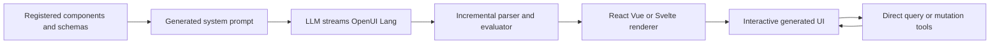

# OpenUI

> Research status: **Source-level** · Last reviewed: **2026-08-12**

| Field | Verified value |
|---|---|
| Maintainer | Thesys / OpenUI contributors |
| Ordinary job | let a model generate a bounded interactive interface that can stream into view and then execute without another model call |
| Canonical artifact | OpenUI Lang program plus the registered component-library contract and runtime state |
| Renderers | React first-party plus Vue and Svelte bindings; browser and email packages are also shipped |
| License | MIT |
| Pinned source | [`bf5da82a08ea569e180bb9854db88a87835877d6`](https://github.com/thesysdev/openui/tree/bf5da82a08ea569e180bb9854db88a87835877d6) |

OpenUI is generative-UI infrastructure rather than a hosted design canvas. It qualifies because it owns a declarative artifact language and executable runtime contract: the output is not only text guidance for another tool and not arbitrary model-authored JavaScript.

## The component library is the generation boundary

An application registers components and typed props. OpenUI derives the model instructions from that library, so the model can compose only the declared vocabulary. The model streams compact OpenUI Lang; the parser builds structure progressively and the renderer maps it to the host framework's components.

This is a safety and governance boundary rather than proof of good design. A registered component can still be used poorly and the application developer still controls the model prompt, tools and data access.

## Generation and execution are intentionally separated

OpenUI Lang can describe layout, reactive variables, queries, mutations and action wiring. After generation, the runtime handles state changes and invokes registered tools directly. A dropdown change can invalidate dependent queries and a button action can run a mutation without asking the LLM to regenerate the screen. The language program therefore remains an executable authority for ongoing interaction.

Incremental editing changes parts of that program rather than requiring a whole new opaque UI blob. Built-in functions and reactive expressions are evaluated by the runtime; model output does not gain unrestricted host-code execution merely by appearing in the stream.

## Source topology

| Pinned path | Decisive evidence |
|---|---|
| [`packages/lang-core/`](https://github.com/thesysdev/openui/tree/bf5da82a08ea569e180bb9854db88a87835877d6/packages/lang-core) | language parser, prompt generation, runtime evaluation and types |
| [`packages/react-lang/`](https://github.com/thesysdev/openui/tree/bf5da82a08ea569e180bb9854db88a87835877d6/packages/react-lang) | component registration and streamed React rendering |
| [`packages/vue-lang/`](https://github.com/thesysdev/openui/tree/bf5da82a08ea569e180bb9854db88a87835877d6/packages/vue-lang) | Vue binding for the same language contract |
| [`packages/svelte-lang/`](https://github.com/thesysdev/openui/tree/bf5da82a08ea569e180bb9854db88a87835877d6/packages/svelte-lang) | Svelte binding |
| [`packages/openui-cli/`](https://github.com/thesysdev/openui/tree/bf5da82a08ea569e180bb9854db88a87835877d6/packages/openui-cli) | scaffolding and prompt/schema generation |
| [`examples/openui-chat/`](https://github.com/thesysdev/openui/tree/bf5da82a08ea569e180bb9854db88a87835877d6/examples/openui-chat) | complete application path rather than isolated library tests |

## Persistence is supplied by the embedding application

The runtime owns execution state while mounted; OpenUI itself does not impose a universal hosted project database or version-history service. Applications that need durable generated programs, user state or audit history must persist them. This is why the census uses `native-graph-authority` without claiming OpenUI is a managed SaaS document store.

## Primary evidence

- [Pinned repository](https://github.com/thesysdev/openui/tree/bf5da82a08ea569e180bb9854db88a87835877d6)
- [OpenUI Lang architecture](https://www.openui.com/docs/openui-lang/how-it-works)
- [Reactive state](https://www.openui.com/docs/openui-lang/reactive-state)
- [Queries and mutations](https://www.openui.com/docs/openui-lang/queries-mutations)
- [Incremental editing](https://www.openui.com/docs/openui-lang/incremental-editing)
- [MIT license](https://github.com/thesysdev/openui/blob/bf5da82a08ea569e180bb9854db88a87835877d6/LICENSE)
