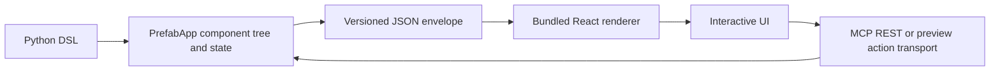

# Prefab

> Research status: **Source-level** · Last reviewed: **2026-08-12**

| Field | Verified value |
|---|---|
| Maintainer | Prefect |
| Authoring authority | Python component tree state definitions and actions |
| Wire artifact | protocol-versioned `PrefabApp` JSON envelope |
| Runtime | bundled React renderer with MCP REST or preview transport |
| Pinned source | [`d81dce796c1f1c0371ebd2285cb2d574a616ad23`](https://github.com/PrefectHQ/prefab/tree/d81dce796c1f1c0371ebd2285cb2d574a616ad23) |

Prefab lets humans or agents compose interactive interfaces in Python from more than one hundred prebuilt components. It targets composition rather than model-authored arbitrary frontend construction: Python source compiles to a declarative protocol and a trusted renderer supplies concrete React behavior.

## `PrefabApp` is the serialization boundary

The app object contains a view state reusable definitions stylesheets mode and key bindings. `to_json()` emits a `$prefab` protocol marker plus `view` `defs` and `state`; at the pinned revision the protocol version is `0.3`. Components actions and reactive expressions serialize through Pydantic rather than being sent as live Python objects.

`CallTool` can reference a function or name and is resolved during serialization. The renderer sends the event and current state through its selected transport and prefers typed `structuredContent` when a tool returns it. Tool authorization remains the host's responsibility.

## Generative mode writes Python inside a sandbox

`GenerativeUI` exposes component search guidance and accepts model-written Prefab Python. Browser rendering lazily loads Pyodide on the first partial tool input and executes progressively streamed code; the server-side sandbox uses a warm Deno process with Pyodide to validate the same class of output. Only the Prefab component vocabulary that imports and serializes successfully becomes UI.

Pyodide is a containment layer not proof that generated code is harmless. The runner is allowed to read mounted Prefab source and fetch its CDN dependencies and the embedding host must still bound tools network policy and displayed content.

## Source map

| Pinned path | Evidence |
|---|---|
| [`src/prefab_ui/app.py`](https://github.com/PrefectHQ/prefab/blob/d81dce796c1f1c0371ebd2285cb2d574a616ad23/src/prefab_ui/app.py) | app model protocol version and envelope serialization |
| [`src/prefab_ui/components/`](https://github.com/PrefectHQ/prefab/tree/d81dce796c1f1c0371ebd2285cb2d574a616ad23/src/prefab_ui/components) | typed component vocabulary |
| [`src/prefab_ui/actions/`](https://github.com/PrefectHQ/prefab/tree/d81dce796c1f1c0371ebd2285cb2d574a616ad23/src/prefab_ui/actions) | state MCP REST and callback actions |
| [`src/prefab_ui/generative.py`](https://github.com/PrefectHQ/prefab/blob/d81dce796c1f1c0371ebd2285cb2d574a616ad23/src/prefab_ui/generative.py) | component introspection and generated-code tool contract |
| [`src/prefab_ui/sandbox/`](https://github.com/PrefectHQ/prefab/tree/d81dce796c1f1c0371ebd2285cb2d574a616ad23/src/prefab_ui/sandbox) | server-side Pyodide validation |
| [`renderer/src/bridge.ts`](https://github.com/PrefectHQ/prefab/blob/d81dce796c1f1c0371ebd2285cb2d574a616ad23/renderer/src/bridge.ts) | MCP bridge and partial generative input |
| [`renderer/src/pyodide/executor.ts`](https://github.com/PrefectHQ/prefab/blob/d81dce796c1f1c0371ebd2285cb2d574a616ad23/renderer/src/pyodide/executor.ts) | in-browser generated Python execution |

## Persistence ceiling

Prefab defines UI state while an app is running but does not impose one hosted database or version-history service. The embedding MCP server REST application or file project must persist authoritative Python and business data. Prefect's first-party company material supports a United States organization boundary.

## Primary evidence

- [Pinned repository](https://github.com/PrefectHQ/prefab/tree/d81dce796c1f1c0371ebd2285cb2d574a616ad23)
- [Prefab documentation](https://prefab.prefect.io/docs/welcome)
- [Generative UI documentation](https://prefab.prefect.io/docs/generative)
- [License](https://github.com/PrefectHQ/prefab/blob/d81dce796c1f1c0371ebd2285cb2d574a616ad23/LICENSE)
- [Prefect company](https://www.prefect.io/company)
