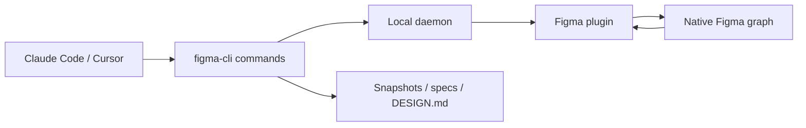

# figma-cli

> Research status: **Source-level** · Last reviewed: **2026-08-12**

`figma-cli` gives coding agents a local command surface over Figma Desktop. Its defining claim is observable: commands create and edit real frames, components, variants, variables and text in the open native document rather than exporting a flat reconstruction.

## Local bridge topology

The agent can inspect before mutating, plan variant changes, import variables in chunks and take snapshots. The CLI also extracts design-system material for source handoff. Figma remains the authority; generated specs are projections.

## Pinned source

At commit [`8d98acd`](https://github.com/silships/figma-cli/commit/8d98acd9677a9f21bc2f5406a05bcd80a2b98cb5):

- [`daemon.js`](https://github.com/silships/figma-cli/blob/8d98acd9677a9f21bc2f5406a05bcd80a2b98cb5/src/daemon.js), [`figma-client.js`](https://github.com/silships/figma-cli/blob/8d98acd9677a9f21bc2f5406a05bcd80a2b98cb5/src/figma-client.js) and [plugin code](https://github.com/silships/figma-cli/blob/8d98acd9677a9f21bc2f5406a05bcd80a2b98cb5/plugin/code.js) implement transport.
- canvas, variable, variant, token, snapshot and spec commands live under [`src/commands`](https://github.com/silships/figma-cli/tree/8d98acd9677a9f21bc2f5406a05bcd80a2b98cb5/src/commands).
- [`design-extract.js`](https://github.com/silships/figma-cli/blob/8d98acd9677a9f21bc2f5406a05bcd80a2b98cb5/src/design-extract.js) and [`design-md.js`](https://github.com/silships/figma-cli/blob/8d98acd9677a9f21bc2f5406a05bcd80a2b98cb5/src/design-md.js) supply the design-system projection.
- round-trip, rendering, variable and snapshot behavior has dedicated tests under [`tests/`](https://github.com/silships/figma-cli/tree/8d98acd9677a9f21bc2f5406a05bcd80a2b98cb5/tests).

## Boundary

The project does not require the Figma REST API or an MCP server; it is still an agent interface because the coding agent drives the CLI and plugin. The repository is MIT-licensed. No reliable maintainer-region evidence was found.

## Decisive sources

- [Repository README](https://github.com/silships/figma-cli/blob/8d98acd9677a9f21bc2f5406a05bcd80a2b98cb5/README.md)
- [Command reference](https://github.com/silships/figma-cli/blob/8d98acd9677a9f21bc2f5406a05bcd80a2b98cb5/docs/COMMANDS.md)
- [MIT license](https://github.com/silships/figma-cli/blob/8d98acd9677a9f21bc2f5406a05bcd80a2b98cb5/LICENSE)
