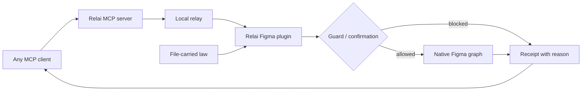

# Figma Relai

> Research status: **Source-level** · Last reviewed: **2026-08-11**

| Field | Value |
|---|---|
| Team | Figma Relai contributors |
| Ordinary job | let the user's existing MCP agent work inside Figma while file-owned rules constrain what it may change |
| Canonical artifact | the native Figma file |
| Governance state | conventions, precedents, no-go zones and confirmation policy stored as plugin data in the file |
| Pinned source | [`2c3fea8a12c270188f8368bf077f7ba2a4f33459`](https://github.com/syoooo/figma-relai/tree/2c3fea8a12c270188f8368bf077f7ba2a4f33459) |

## The design file carries executable policy

Relai's distinctive claim is not the number of Figma write tools. Rules normally repeated in prompts are persisted as plugin data inside the Figma file. Conventions describe local practice; precedents record intentional exceptions; no-go zones fence entire pages; a confirmation dial decides which classes of operations require approval; selection lock limits target scope.

Some of that policy is advisory context, while no-go zones and selection lock are enforced at the plugin boundary before a write. This difference matters. A remembered note can influence the model; an enforced guard rejects the operation even if the model ignores prose.

## Receipts make the mutation path observable

Every operation appears in the plugin activity feed with timing and success/failure. Selecting a receipt can navigate to the affected layer, and Stop cancels the remaining queued work. Batch execution is therefore visible to the designer instead of occurring only in an agent transcript.

Stopping is not rollback. The security documentation and README state that arbitrary `execute_figma` scripts are not atomic: mutations completed before an exception remain. Structured tools and approval gates narrow common work, but recovery still needs checkpoints, Figma undo/version history or a prior duplicate.

## Confirmation is controlled on the canvas side

The designer chooses OPEN, RISK, BULK or ALL in the plugin panel; agents cannot move the dial. At the default risk-sensitive level, destructive actions require confirmation while ordinary scoped edits can proceed. No-go pages and selection locks are similarly file/plugin-side controls.

This is a meaningful separation of roles: the model proposes work, while the active design artifact sets the authority envelope. The envelope applies only to clients using Relai. Another Figma plugin or bridge is a different door and is not governed by Relai's plugin data.

## Memory follows duplication but not every Figma operation

File plugin data survives ordinary file duplication, so a copied design can inherit its conventions. Figma branch merges may drop that data; Relai kits provide a way to restore shared policy across files. The kit is therefore a recovery/distribution mechanism, not proof that Figma merges policy semantically.

Checkpoints and diffs help review a run. Figma version history remains the authoritative historical document system. Relai does not claim a separate magical undo stack capable of reversing arbitrary generated Plugin API code.

## Commit-level implementation map

| Pinned path | Evidence |
|---|---|
| `packages/figma-plugin/src/handlers/plugin-data.ts` | file-carried policy storage |
| `.../handlers/guards.ts` | no-go and scoped write enforcement |
| `.../handlers/rulesets.ts`, `.../handlers/memory.ts` | conventions, kits and precedents |
| `packages/mcp-server/src/tools/core/` | structured read/write tool contracts |
| `packages/mcp-server/src/tools/core/execute.ts` | broad script execution boundary |
| `packages/mcp-server/src/request-tracker.ts`, plugin event buffer | receipts, progress and cancellation coordination |
| `SECURITY.md` | trust boundary and non-atomic script warning |

## Tests that match Relai's real thesis

The decisive tests are attempts to violate policy: write to a no-go page, mutate outside a locked selection, run a bulk/destructive action at each confirmation level, stop midway through a batch, duplicate a file, merge a Figma branch and reconnect from a different MCP client. A successful “create frame” demo would verify reach but not the file-governance mechanism that makes Relai distinct.

## Primary evidence

- [Pinned repository](https://github.com/syoooo/figma-relai/tree/2c3fea8a12c270188f8368bf077f7ba2a4f33459)
- [Relai product site](https://figma-relai.vercel.app/)
- [Pinned security model](https://github.com/syoooo/figma-relai/blob/2c3fea8a12c270188f8368bf077f7ba2a4f33459/SECURITY.md)
