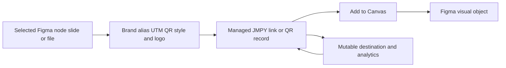

# JMPY.me

> Research status: **Architecture-level / public interface package** · Last reviewed: **2026-08-12**

JMPY.me joins two artifact authorities that are easy to mistake for one. Figma owns the placed visual QR or link object; JMPY.me owns the mutable destination, branded domain, UTM configuration and analytics behind it. A printed QR can therefore remain visually unchanged while its managed target changes.

## The canvas object is a projection of a managed delivery artifact

The plugin works across Figma Design, FigJam, Slides and Buzz. The user selects a canvas object or file, configures branding and tracking, and explicitly inserts the result. The managed record remains operational after insertion: destination updates and scan/click analytics belong to JMPY.me, not to Figma history.

## Agent control reaches the managed record, not automatically the Figma node

JMPY.me separately advertises MCP integrations for Claude, Grok, ChatGPT and other clients to create and update links or QR codes and query analytics. The public `jmpy-mcp-server` repository was pinned at commit `16b5bb53030ac4ff0d5673e2a2da2b19c7238d4c`. It contains setup metadata, a README and skill/config packaging, but no server implementation and no license. It supports an interface claim, not a source-level architecture claim.

Public evidence does not establish stable identity between an MCP-created managed record and a previously inserted Figma node, automatic canvas refresh after a destination change, rollback semantics, analytics retention or how branded assets are serialized in the native graph.

## Primary evidence

- [Creator Figma-plugin announcement](https://forum.figma.com/showcase-your-work-14/introducing-jmpy-me-your-all-in-one-link-qr-management-plugin-for-figma-55956)
- [Official product and London location](https://jmpy.me/about-us)
- [Official QR product surface](https://jmpy.me/tool/qr-code-generator)
- [Public MCP packaging](https://github.com/Jmpy-me/jmpy-mcp-server/tree/16b5bb53030ac4ff0d5673e2a2da2b19c7238d4c)
- [Figma Community plugin 1652124319511508893](https://www.figma.com/community/plugin/1652124319511508893)
