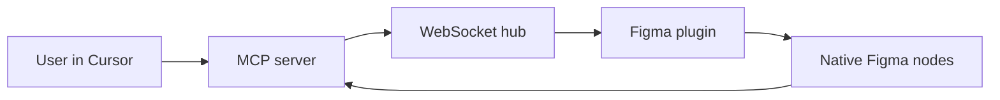

# QBIC

> Research status: **Source-level** · Lifecycle: **active** · Last reviewed: **2026-08-12**

QBIC demonstrates cross-application agent programming through a concrete Figma bridge. Cursor supplies model reasoning; an MCP server and WebSocket hub translate tool calls; a Figma plugin performs native node operations.

## The Figma document remains authoritative

At commit [`78d8a7e`](https://github.com/QbicMCP/QBIC/tree/78d8a7e45542c3f664ebddeb494dffaa9c56ebdf) [`server.ts`](https://github.com/QbicMCP/QBIC/blob/78d8a7e45542c3f664ebddeb494dffaa9c56ebdf/src/qbic_mcp/server.ts) declares operations such as rectangle and text creation scanning batch text replacement annotations reactions and connectors. [`code.js`](https://github.com/QbicMCP/QBIC/blob/78d8a7e45542c3f664ebddeb494dffaa9c56ebdf/src/cursor_mcp_plugin/code.js) executes those commands inside Figma.

QBIC describes a broader multi-tool architecture but the pinned implementation proves the Figma example rather than every advertised integration. It is counted as an external agent bridge and not as a second Figma product. Public first-party evidence did not establish the team region.

## Evidence

- [Pinned README](https://github.com/QbicMCP/QBIC/blob/78d8a7e45542c3f664ebddeb494dffaa9c56ebdf/readme.md)
- [Figma plugin manifest](https://github.com/QbicMCP/QBIC/blob/78d8a7e45542c3f664ebddeb494dffaa9c56ebdf/src/cursor_mcp_plugin/manifest.json)
- [Message hub](https://github.com/QbicMCP/QBIC/blob/78d8a7e45542c3f664ebddeb494dffaa9c56ebdf/src/socket.ts)
