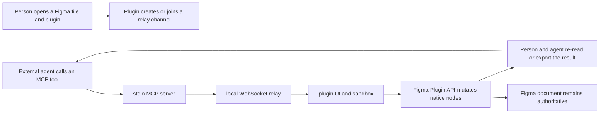

# TalkToFigma

> Research status: **Source-level** · Last reviewed: **2026-08-11**

| Field | Value |
|---|---|
| Public project / maintainer boundary | TalkToFigma maintainers; canonical repository currently lives in the `grab` GitHub organization and the MIT notice attributes the 2025 origin to Sonny Lazuardi |
| Ordinary job | let an MCP-capable coding agent inspect and mutate the Figma or FigJam document a person already has open |
| Status | active open-source project; latest reviewed commit adds further write operations on 2026-07-26 |
| Canonical artifact | the open Figma/FigJam document graph; TalkToFigma is a transport and operation adapter rather than a second design store |
| Source | [grab/cursor-talk-to-figma-mcp](https://github.com/grab/cursor-talk-to-figma-mcp) |
| Pinned revision | [`ddd90f3a6d454ea0b2fc29f1b084f50fd062b880`](https://github.com/grab/cursor-talk-to-figma-mcp/tree/ddd90f3a6d454ea0b2fc29f1b084f50fd062b880) |
| Evidence ceiling | source establishes the local protocol and Figma mutations; Figma's own storage, multiplayer, undo and version-history internals remain outside this repository |

## Its product is a temporary control path into a native document

TalkToFigma does not create a parallel canvas, export a design to code, or make the agent's chat the durable artifact. The [pinned README](https://github.com/grab/cursor-talk-to-figma-mcp/blob/ddd90f3a6d454ea0b2fc29f1b084f50fd062b880/README.md) asks the user to open Figma, run a plugin, join a channel and then use an MCP client such as Cursor or Claude Code. The adapter gives that external agent both read tools and native-object write tools.

The ordinary loop is therefore:

This is a consequential boundary. A successful MCP response proves that a plugin command returned; it does not establish that a downstream codebase now matches the design or that Figma's remote synchronization and version history have completed.

## The bridge is three processes rather than one integration

At the pinned revision the path crosses three public components:

1. [`server.ts`](https://github.com/grab/cursor-talk-to-figma-mcp/blob/ddd90f3a6d454ea0b2fc29f1b084f50fd062b880/src/talk_to_figma_mcp/server.ts) publishes MCP tools over stdio. Each handler turns typed arguments into a named Figma command and waits for a response keyed by a UUID.
2. [`socket.ts`](https://github.com/grab/cursor-talk-to-figma-mcp/blob/ddd90f3a6d454ea0b2fc29f1b084f50fd062b880/src/socket.ts) is a Bun WebSocket relay on port `3055`. It groups clients by channel and broadcasts commands and responses to the other peers in that channel.
3. The Figma plugin's [`ui.html`](https://github.com/grab/cursor-talk-to-figma-mcp/blob/ddd90f3a6d454ea0b2fc29f1b084f50fd062b880/src/cursor_mcp_plugin/ui.html) owns the socket and correlates pending request ids; [`code.js`](https://github.com/grab/cursor-talk-to-figma-mcp/blob/ddd90f3a6d454ea0b2fc29f1b084f50fd062b880/src/cursor_mcp_plugin/code.js) runs in the plugin sandbox and dispatches commands to the Figma Plugin API.

The relay deliberately has no design semantics. It neither validates node operations nor stores a document. Its state is a process-local map from channel names to connected sockets. Closing the relay loses that routing state but not the Figma changes already accepted by the host.

## Native node ids carry identity across the agent boundary

The bridge reads and writes Figma objects by native node id. The operation surface includes document and selection inspection, node reads, text scanning, annotations, prototype reactions, components and overrides, and direct construction or mutation of frames, text, rectangles, sections, image fills, layout, styles, parentage and selection.

That makes identity stronger than screenshot coordinates but narrower than semantic source mapping:

| Identity available to the agent | What it supports | What it does not prove |
|---|---|---|
| Figma node id and type | targeted read or mutation in the currently open document | stable identity after copy/paste, replacement or import |
| parent/child graph and absolute position | structural placement and reparenting | equivalence to a code component or DOM element |
| component and instance ids | local component lookup and override propagation | repository symbol identity or design-system package version |
| selection and current page | human-directed scope for the next command | durable task scope after the plugin or file changes |
| exported image bytes | visual evidence for a node at one moment | preservation of editable structure or interaction behavior |

There is no source-locator schema in the project. Any claim that a Figma node corresponds to a React component, route or source range must come from another tool or convention.

## Write authority is broad and immediate

The latest pinned change added `set_image_fill`, `rename_node`, `create_section` and `set_parent`. In the plugin implementation these are not suggestions: calls such as `figma.createSection()`, `appendChild`, node property assignments and `remove()` directly mutate the host graph. The command set also supports bulk text replacement and component-override propagation, so a single agent action can touch many nodes.

The repository documents recommended read-before-write and verify-after-write behavior, but source inspection found no transaction wrapper or project-owned undo journal. Partial progress messages improve observability for long scans or batches; they do not make a multi-node operation atomic. Recovery therefore falls back to the Figma host and whatever document/version controls the user has there.

Two product limitations follow from this mechanism:

- the bridge can automate native authoring without owning persistence;
- the bridge can read design structure without knowing whether that structure is semantically correct for a codebase.

## Session state is intentionally thinner than artifact state

The plugin persists only local connection settings and a few helper values through `figma.clientStorage`, including the anonymous analytics client id and default connector id. The WebSocket channel and MCP pending-request map live in memory. The native Figma document holds design changes.

The pinned [`manifest.json`](https://github.com/grab/cursor-talk-to-figma-mcp/blob/ddd90f3a6d454ea0b2fc29f1b084f50fd062b880/src/cursor_mcp_plugin/manifest.json) allows `ws://localhost:3055` and Google Analytics; the relay accepts channel joins without an authentication or authorization layer in its source. Localhost is the default exposure boundary, but the README also documents remote/TLS and WSL variants. Anyone changing that network boundary must supply access control outside this code; a channel name alone is routing identity rather than a security principal.

There is no project database, migration layer, saved conversation, durable operation log or version graph. That absence is architectural evidence: TalkToFigma is an ephemeral control plane over a document whose durability belongs to Figma.

## Implementation map at the pinned revision

| Project-specific concern | Path | Evidence |
|---|---|---|
| MCP operation contracts and request correlation | [`src/talk_to_figma_mcp/server.ts`](https://github.com/grab/cursor-talk-to-figma-mcp/blob/ddd90f3a6d454ea0b2fc29f1b084f50fd062b880/src/talk_to_figma_mcp/server.ts) | tool schemas; UUID request ids; timeout and progress tracking; stdio transport |
| channel routing | [`src/socket.ts`](https://github.com/grab/cursor-talk-to-figma-mcp/blob/ddd90f3a6d454ea0b2fc29f1b084f50fd062b880/src/socket.ts) | in-memory channels; peer broadcast; port `3055`; no durable queue |
| browser-side transport inside Figma | [`src/cursor_mcp_plugin/ui.html`](https://github.com/grab/cursor-talk-to-figma-mcp/blob/ddd90f3a6d454ea0b2fc29f1b084f50fd062b880/src/cursor_mcp_plugin/ui.html) | random channel creation; WebSocket lifecycle; pending request correlation; UI-to-sandbox messages |
| native document reads and writes | [`src/cursor_mcp_plugin/code.js`](https://github.com/grab/cursor-talk-to-figma-mcp/blob/ddd90f3a6d454ea0b2fc29f1b084f50fd062b880/src/cursor_mcp_plugin/code.js) | Figma Plugin API object creation, mutation, selection, export and client storage |
| host and network permissions | [`src/cursor_mcp_plugin/manifest.json`](https://github.com/grab/cursor-talk-to-figma-mcp/blob/ddd90f3a6d454ea0b2fc29f1b084f50fd062b880/src/cursor_mcp_plugin/manifest.json) | Figma/FigJam scope; dynamic-page document access; localhost and analytics allowlist |
| package entry and runtime dependencies | [`package.json`](https://github.com/grab/cursor-talk-to-figma-mcp/blob/ddd90f3a6d454ea0b2fc29f1b084f50fd062b880/package.json) | Bun/npm CLI packaging; MCP SDK; WebSocket; Zod; current package version `0.3.5` |

No automated test files are present in the pinned tree. Source-level here means the decisive path is inspectable; it does not mean the operation matrix has regression coverage.

## Commit evidence changes the causal model

| Date | Commit | Architectural consequence |
|---|---|---|
| 2025-03-17 | [`9f7603dc5619c3b89fd664dd63ddd247852306fe`](https://github.com/grab/cursor-talk-to-figma-mcp/commit/9f7603dc5619c3b89fd664dd63ddd247852306fe) | establishes the project lineage |
| 2025-04-27 | [`f180970132bc7828810499e32948f579fb6c7438`](https://github.com/grab/cursor-talk-to-figma-mcp/commit/f180970132bc7828810499e32948f579fb6c7438) | makes prototype reactions readable and materializable as FigJam connectors rather than limiting the bridge to static node edits |
| 2025-09-02 | [`54b8e4413248e6a5d53468e4660b26da9f18fe0a`](https://github.com/grab/cursor-talk-to-figma-mcp/commit/54b8e4413248e6a5d53468e4660b26da9f18fe0a) | adds agent-driven focus and selection so human and agent can coordinate scope on the live canvas |
| 2026-03-07 | [`08a58a294fb3a40196e8a9625ee6ccff42d3c663`](https://github.com/grab/cursor-talk-to-figma-mcp/commit/08a58a294fb3a40196e8a9625ee6ccff42d3c663) | forwards progress and expands local-component handling; the protocol becomes more observable for long operations |
| 2026-07-26 | [`ddd90f3a6d454ea0b2fc29f1b084f50fd062b880`](https://github.com/grab/cursor-talk-to-figma-mcp/commit/ddd90f3a6d454ea0b2fc29f1b084f50fd062b880) | expands native write authority to images, naming, sections and parentage |

## Evidence boundary

- **Established:** TalkToFigma is a currently active source-visible MCP/plugin bridge; the external agent can read and directly mutate native Figma/FigJam nodes; the public process boundary and operation paths above exist at the pinned revision.
- **Inference:** because native Plugin API operations mutate the open host document and the adapter has no store, Figma—not TalkToFigma—is the durable design authority.
- **Not established:** atomic multi-operation transactions, project-owned undo, authenticated channel isolation, durable request history, semantic design-to-code identity, or successful remote synchronization after any specific command.
- **Not tested in this pass:** installing the community plugin in a signed-in Figma account and executing a live write/undo/version-history journey. That requires a host account and mutable user document; source evidence is not substituted for that acceptance test.

## Primary sources

- [Pinned repository README](https://github.com/grab/cursor-talk-to-figma-mcp/blob/ddd90f3a6d454ea0b2fc29f1b084f50fd062b880/README.md)
- [Pinned source tree](https://github.com/grab/cursor-talk-to-figma-mcp/tree/ddd90f3a6d454ea0b2fc29f1b084f50fd062b880)
- [Figma Community plugin listing](https://www.figma.com/community/plugin/1485687494525374295/cursor-talk-to-figma-mcp-plugin)
- [MIT license and maintainer attribution](https://github.com/grab/cursor-talk-to-figma-mcp/blob/ddd90f3a6d454ea0b2fc29f1b084f50fd062b880/LICENSE)

## Research gaps

- Run a bounded live Figma file experiment to measure permission prompts, undo granularity, version-history visibility and partial batch failure.
- Test whether copied, detached or imported nodes retain identifiers expected by a later agent step.
- Audit published npm bytes against the pinned repository and document any release-to-source lag.
