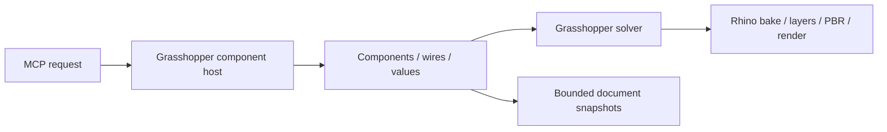

# Cordyceps

> Research status: **Source-level** · Last reviewed: **2026-08-12**

Cordyceps exposes Grasshopper's parametric document to MCP clients. It is not a geometry generator beside Rhino: the server can create components, wire parameters, change values, group objects, bake geometry and control Rhino scene state inside the user's existing engineering workflow.

## The Grasshopper document stays authoritative

The user places a Cordyceps component on the Grasshopper canvas. It hosts a local HTTP MCP endpoint. An AI client or ordinary script calls the same tools:

- `gh_canvas` creates and edits components, values, groups and variable parameters;
- `gh_document` saves, clears, controls the solver, captures the canvas and manages snapshots;
- geometry and analysis tools inspect results;
- `rhino_scene` manages baked objects, layers, selection, materials and rendering.

The agent therefore operates on a native parametric graph. Rhino objects are downstream delivery/materialization state, not a replacement for component and wire authority.

## Recovery is snapshot-first

Cordyceps deliberately disables Grasshopper undo/redo through this remote path and instead keeps at most twenty document snapshots, evicting the oldest. That limit is consequential: an agent should snapshot before a risky graph mutation, and recovery restores a complete document state rather than attempting to reverse an ambiguous sequence of remote calls.

## Pinned implementation

At commit [`af2b2c6`](https://github.com/brookstalley/cordyceps/commit/af2b2c687d5fa8191d2f740f7b546ece01999c07):

- [`McpServer.cs`](https://github.com/brookstalley/cordyceps/blob/af2b2c687d5fa8191d2f740f7b546ece01999c07/src/Cordyceps/McpServer.cs) hosts the protocol boundary.
- [`GhCanvasTool.cs`](https://github.com/brookstalley/cordyceps/blob/af2b2c687d5fa8191d2f740f7b546ece01999c07/src/Cordyceps/Tools/Unified/GhCanvasTool.cs) and its partials implement graph operations.
- [`GhDocumentTool.cs`](https://github.com/brookstalley/cordyceps/blob/af2b2c687d5fa8191d2f740f7b546ece01999c07/src/Cordyceps/Tools/Unified/GhDocumentTool.cs) owns save/clear/snapshot semantics.
- [`SnapshotStore.cs`](https://github.com/brookstalley/cordyceps/blob/af2b2c687d5fa8191d2f740f7b546ece01999c07/src/Cordyceps/Core/SnapshotStore.cs) and its [tests](https://github.com/brookstalley/cordyceps/blob/af2b2c687d5fa8191d2f740f7b546ece01999c07/src/Cordyceps.Tests/SnapshotStoreTests.cs) make the bounded recovery policy explicit.

## Scope and evidence

The project is MIT-licensed. Source inspection establishes the protocol and mutation path, but Rhino 8.21+ was not installed for a live document test. The maintainer profile identifies Seattle and supports a United States team-region label.

## Decisive sources

- [Repository README](https://github.com/brookstalley/cordyceps/blob/af2b2c687d5fa8191d2f740f7b546ece01999c07/README.md)
- [Tool documentation](https://github.com/brookstalley/cordyceps/tree/af2b2c687d5fa8191d2f740f7b546ece01999c07/docs)
- [MIT license](https://github.com/brookstalley/cordyceps/blob/af2b2c687d5fa8191d2f740f7b546ece01999c07/LICENSE)
- [Maintainer profile](https://github.com/brookstalley)
