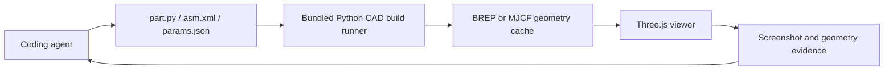

# Forgent3D

> Research status: **Source-level** · Last reviewed: **2026-08-12**

| Field | Value |
|---|---|
| Team | Forgent3D · maintainer region not established |
| Surfaces | hosted Cloud workbench installable agent skill and open desktop companion |
| Ordinary job | have a coding agent write parametric CAD source then rebuild inspect and correct real geometry |
| Authority | `part.py` or assembly source plus `params.json` and model package files |
| Pinned desktop revision | `bd07a9b976621456b6640774b0d85a4493e02798` (`v0.8.0`) |
| Lifecycle | active transition |

## The desktop source closes the visual verification loop

At the pinned revision the Electron MCP server registers `list_models` `screenshot_model` and `rebuild_model`. Rebuild is documented in code as the trusted verification entry and returns build status stderr cache size face count and kernel. A successful rebuild populates geometry and screenshot caches before the agent requests a selected or preset view.

The model package separates editable sources:

- `part.py` or assembly Python defines build123d geometry.
- `asm.xml` describes MJCF assembly references.
- `params.json` supplies values and viewer materials without mixing preview styling into geometry.
- the viewer loads generated BREP or MJCF output and can provide screenshots and bounding information to the agent.

The current Cloud path packages prompt code execution preview and revision remotely. The installable skill lets an external coding agent keep model source in its repository while built results land in the workspace. These are control surfaces over the same code-first mechanism rather than three teams.

## Source boundary

The pinned repository proves the open desktop runner viewer bridge and local MCP behavior. It does not expose the hosted service implementation model provider or cloud version store. The current skills repository head was separately observed at `f98fdb6ee076d143a1b9f4b094463aff855fe9c1` but is not used as the desktop architecture pin.

## Primary evidence

- [Forgent3D Cloud and skill workflow](https://forgent3d.com/en)
- [Pinned desktop source tree](https://github.com/forgent3d/forgent3d-desktop/tree/bd07a9b976621456b6640774b0d85a4493e02798)
- [Pinned MCP server implementation](https://github.com/forgent3d/forgent3d-desktop/blob/bd07a9b976621456b6640774b0d85a4493e02798/packages/electron/electron/mcp-server.ts)
- [Pinned rebuild implementation](https://github.com/forgent3d/forgent3d-desktop/blob/bd07a9b976621456b6640774b0d85a4493e02798/packages/electron/electron/main.rebuild.ts)
