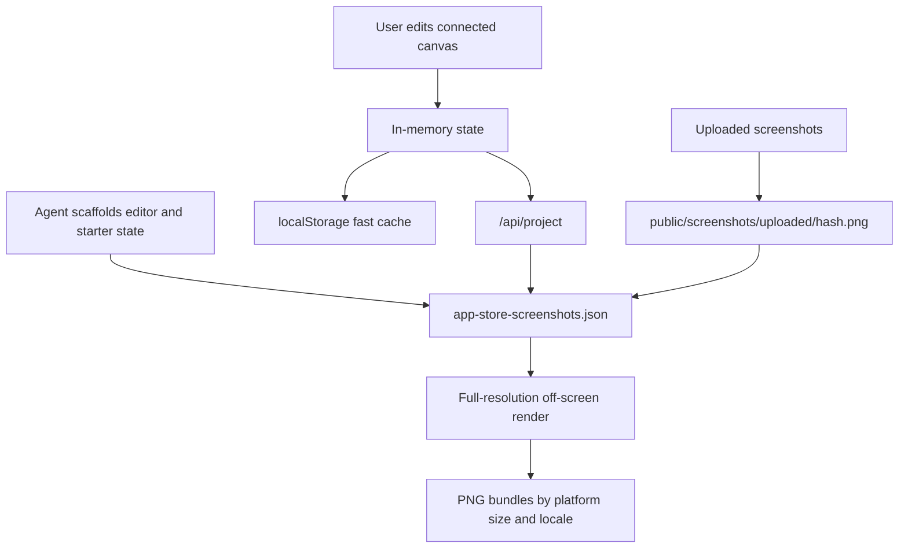

# App Store Screenshots

> Research status: **Source-level** · Last reviewed: **2026-08-11**

| Field | Value |
|---|---|
| Team | Parth Jadhav and contributors |
| Ordinary job | scaffold, visually refine and export localized App Store or Google Play screenshot sets |
| Canonical project | `app-store-screenshots.json` plus referenced uploaded assets |
| Delivery artifacts | PNG bundles rendered at required store dimensions |
| Pinned source | [`e58f81961b5fd9e3969c680061f7cfd8f286ae55`](https://github.com/ParthJadhav/app-store-screenshots/tree/e58f81961b5fd9e3969c680061f7cfd8f286ae55) |

## A generated editor becomes the continuing workspace

This project is distributed as a coding-agent skill that copies a Next.js editor into the user's project. The agent can prefill product name, copy, device choice, locales, source screenshots and a visual direction, but the generated result is not merely a final image. The user receives a connected visual canvas, slide list and inspector for continuing work.

The important handoff is from agent scaffolding to a user-owned project. Once created, the editor can be reopened without the original conversation and the artifact can be committed with the surrounding repository.

## Disk wins over the fast browser cache

`app-store-screenshots.json` carries schema version, app metadata, active platform/device, locale set, theme, connected-canvas choice, slide ordering, copy, source paths and transforms. Runtime uploads are hashed and written under `public/screenshots/uploaded/`; those files must travel with the JSON for a reproducible deck.

The editor mirrors state to `localStorage` for fast first paint, then reconciles with `/api/project`. The pinned storage code explicitly treats the project file as authoritative. If the file endpoint cannot be read, autosave is held back so a stale browser cache cannot overwrite disk after a development-server restart. That asymmetry is a concrete source-of-truth rule rather than vague “autosave” marketing.

## Connected canvas changes the crop model

The editor can place multiple store screenshots on a continuous composition while retaining per-slide crops, or use isolated slide layouts. That means an image's placement is not just a flat list of independent backgrounds: project state must preserve shared geometry and the current connected/isolated mode. Schema-v2 migration code keeps older projects usable without discarding their existing transforms.

## Export is exact and intentionally separate from preview scale

The visible editor can be scaled for the screen. Export instead renders off-screen targets at each Apple or Google requirement and uses `html-to-image` with explicit canvas dimensions. Images are preloaded as data URLs to reduce black or missing captures. Exported PNGs are delivery products; they cannot reconstruct the editor's text objects, crop links or localization state, so the JSON and assets remain the authoring authority.

## Evidence map and acceptance risks

| Pinned path | Evidence |
|---|---|
| `skills/app-store-screenshots/SKILL.md` | scaffold, migration, preservation and ordinary-user procedure |
| `skills/app-store-screenshots/template/app-store-screenshots.json` | versioned project schema example |
| `.../src/lib/storage.ts` | file/cache reconciliation, autosave and undo stacks |
| `.../src/app/api/project/route.ts` | disk read/write boundary |
| `.../src/app/api/upload/route.ts` | content-addressed uploaded assets |
| `.../src/components/editor/screenshot-editor.tsx` | full-resolution PNG capture and bundle logic |

Acceptance should include a fresh clone with committed JSON/assets, a stale local cache, migration from an older project, every declared locale/device size, missing-image recovery and a round trip after reordering or changing connected-canvas mode.

## Primary evidence

- [Pinned repository](https://github.com/ParthJadhav/app-store-screenshots/tree/e58f81961b5fd9e3969c680061f7cfd8f286ae55)
- [Pinned skill](https://github.com/ParthJadhav/app-store-screenshots/blob/e58f81961b5fd9e3969c680061f7cfd8f286ae55/skills/app-store-screenshots/SKILL.md)
- [Pinned storage implementation](https://github.com/ParthJadhav/app-store-screenshots/blob/e58f81961b5fd9e3969c680061f7cfd8f286ae55/skills/app-store-screenshots/template/src/lib/storage.ts)
